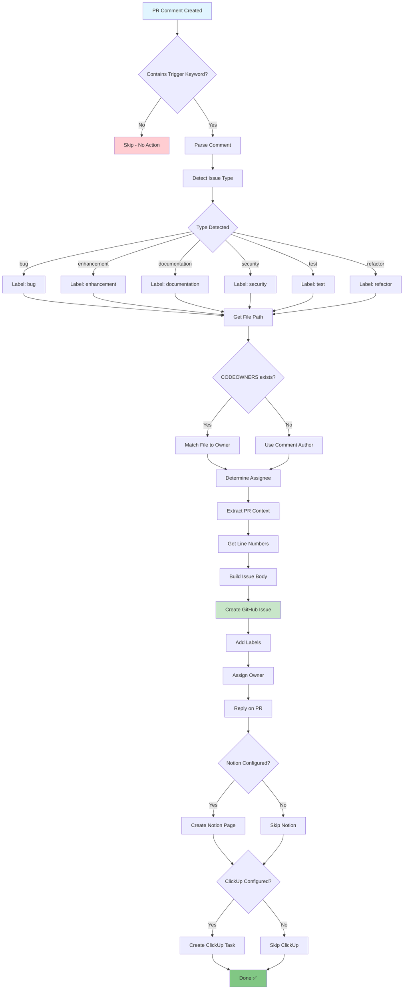
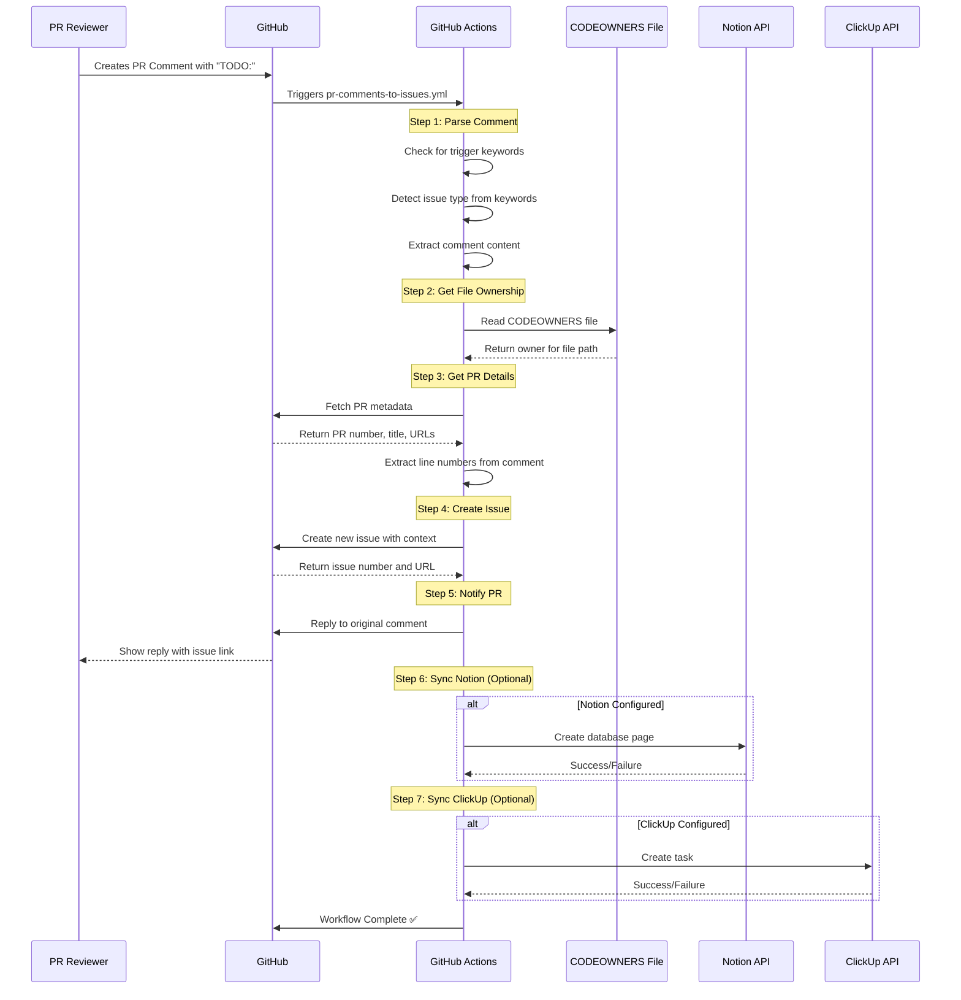
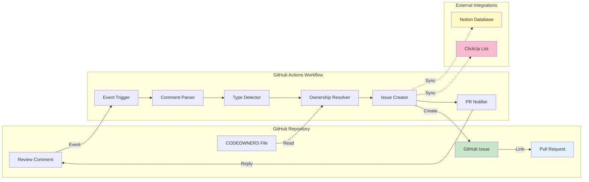
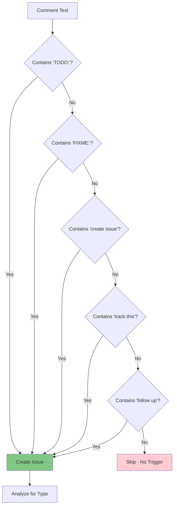
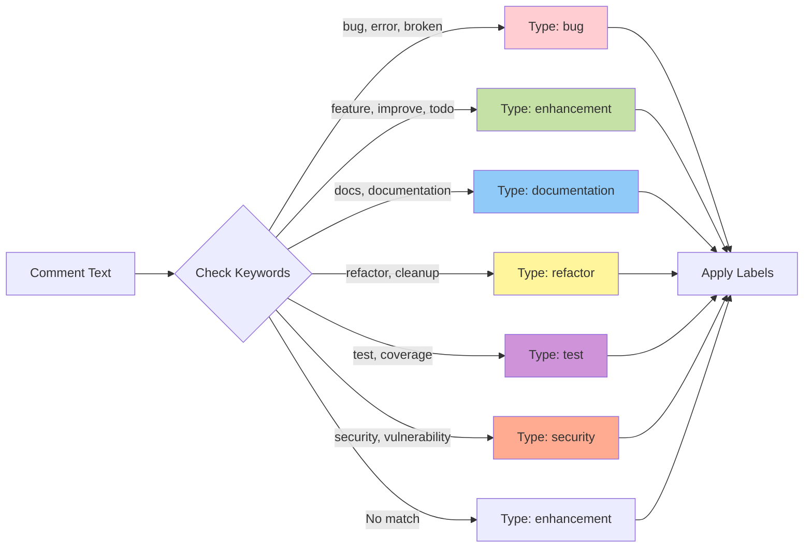
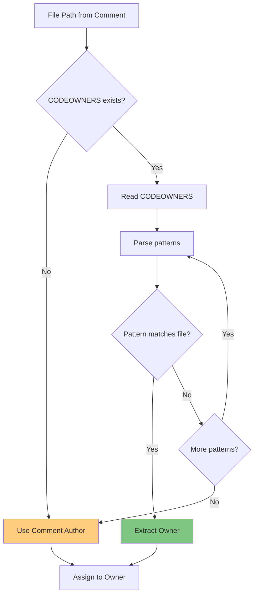
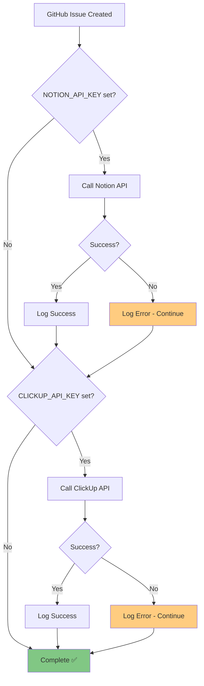
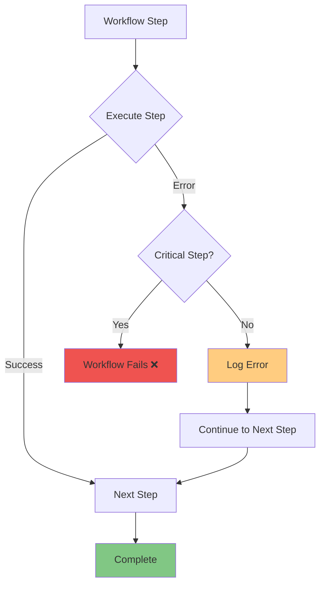
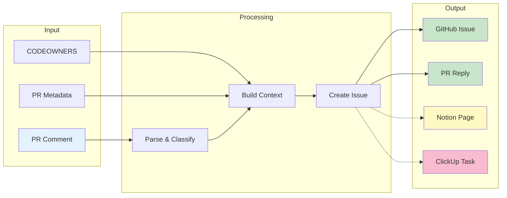
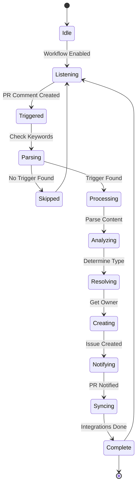

# PR Comments to Issues - Workflow Diagram

## Visual Flow



## Detailed Step Flow



## Component Architecture



## Trigger Detection Logic



## Type Detection Logic



## Ownership Resolution



## Integration Flow



## Error Handling



### Critical vs Non-Critical Steps

**Critical Steps** (Must succeed):
- Parse comment
- Get file ownership
- Create GitHub issue

**Non-Critical Steps** (Continue on error):
- Notion sync
- ClickUp sync
- PR reply (with fallback)

## Data Flow



## Timing Diagram

```mermaid
gantt
    title Workflow Execution Timeline
    dateFormat ss

    section Detection
    Trigger Event           :0, 1s
    Parse Comment          :1s, 2s

    section Analysis
    Detect Type            :3s, 2s
    Get Ownership          :5s, 2s
    Get PR Details         :7s, 2s

    section Creation
    Create GitHub Issue    :9s, 3s
    Reply on PR            :12s, 2s

    section Integration
    Sync to Notion         :14s, 2s
    Sync to ClickUp        :16s, 2s

    section Complete
    Workflow Done          :18s, 1s
```

**Expected Total Time:** 15-30 seconds (depending on integrations)

## State Diagram



## Summary

These diagrams illustrate:

1. **Main Flow** - Overall workflow from comment to issue
2. **Sequence** - Interaction between components
3. **Architecture** - System components and relationships
4. **Trigger Logic** - How trigger keywords are detected
5. **Type Detection** - How issue types are classified
6. **Ownership** - How assignees are determined
7. **Integration** - How external tools are synced
8. **Error Handling** - How errors are managed
9. **Data Flow** - How data moves through the system
10. **Timing** - Expected execution timeline
11. **State** - Workflow state transitions

---

**Note:** These diagrams use Mermaid syntax and will render automatically on GitHub.

**View this file on GitHub to see the rendered diagrams.**
