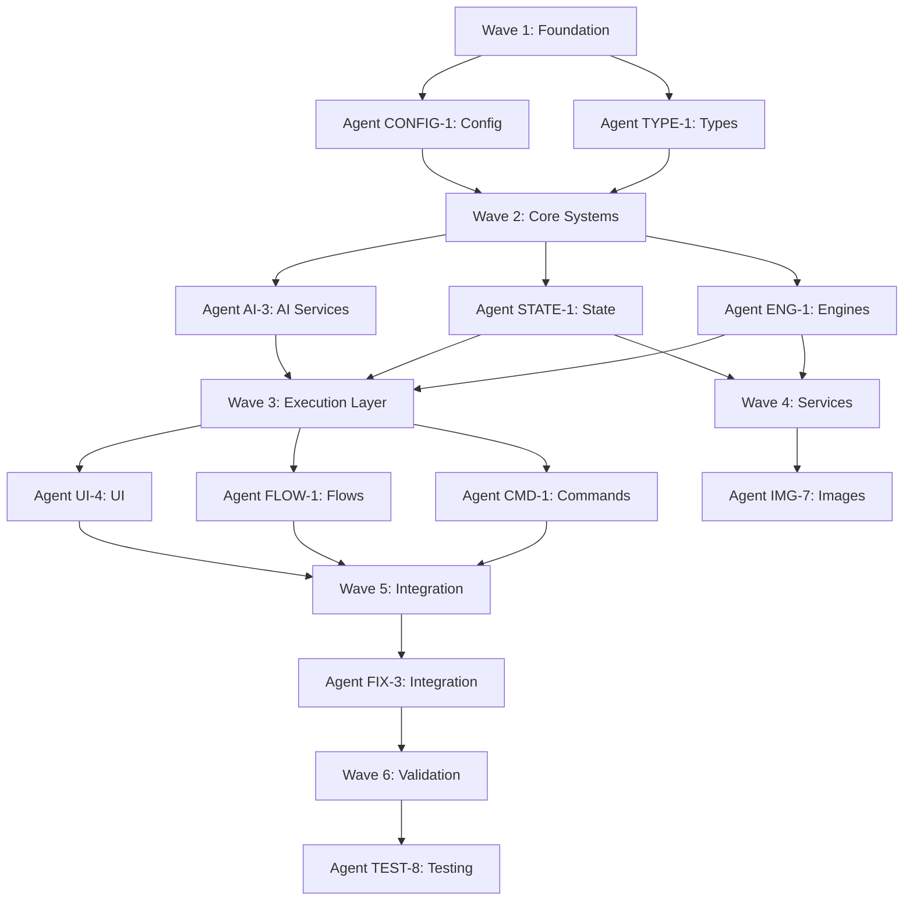

# AI Agent Architecture

**Project**: Apophenia - Cosmic Horror Narrative Engine
**Version**: 2.0.0
**Last Updated**: 2025-11-12
**Maintained by**: Development Team

---

## Executive Summary

Apophenia employs a sophisticated dual-agent architecture: **In-Game AI Agents** (9 revolutionary horror engines that run during gameplay) and **Development AI Agents** (autonomous coding agents that build and maintain the codebase). This document provides comprehensive guidance for both human developers and AI agents working on the project.

### Key Metrics

- **In-Game Engines**: 9 specialized AI engines for psychological horror
- **Development Agent Types**: 10+ specialized coding agent patterns
- **Recent Deployment**: 8 parallel agents, 91/91 tests passing
- **Deployment Speed**: 7-45 minutes per agent (average 25 minutes)
- **Coordination Pattern**: Wave-based execution with dependency management

### Purpose

This documentation enables:
- **Rapid Development**: Deploy 3-10 agents in parallel for complex features
- **Reproducible Results**: Clear patterns for common development scenarios
- **Zero Conflicts**: Seam-based architecture prevents agent collisions
- **Knowledge Transfer**: Onboard new developers and agents quickly
- **Quality Assurance**: Validated patterns with proven success rates

---

## Quick Reference

### Agent Type Classification

| Agent Type | Purpose | Typical Duration | Dependencies | Parallelizable |
|-----------|---------|-----------------|-------------|----------------|
| **AUDIT** | Code analysis, mapping | 15-25 min | None | ✅ Yes |
| **FIX** | Bug repairs, updates | 20-35 min | AUDIT complete | ⚠️ Sometimes |
| **UPDATE** | Migrations, refactors | 25-40 min | Types stable | ⚠️ Sometimes |
| **CLEANUP** | Code organization | 15-20 min | None | ✅ Yes |
| **VERIFY** | Testing, validation | 30-45 min | Code complete | ❌ Sequential |
| **DOC** | Documentation | 10-20 min | None | ✅ Yes |
| **ENG** | Engine implementation | 30-45 min | Types defined | ✅ Yes |
| **STATE** | State management | 20-30 min | Types defined | ✅ Yes |
| **AI** | AI service integration | 30-40 min | Types defined | ✅ Yes |
| **UI** | UI components | 25-35 min | State ready | ⚠️ Sometimes |

### Coordination Patterns at a Glance

```
ORCHESTRATION (Centralized)
    Coordinator
    ├─> Agent 1
    ├─> Agent 2  (after 1)
    └─> Agent 3  (after 2)

CHOREOGRAPHY (Decentralized)
    Agent 1 ──> PR #101
    Agent 2 ──> PR #102  (parallel)
    Agent 3 ──> PR #103  (parallel)

WAVE-BASED (Hybrid)
    Wave 1: [A1, A2] (parallel)
        ↓
    Wave 2: [A3, A4, A5] (parallel, depends on Wave 1)
        ↓
    Wave 3: [A6] (sequential)
```

---

## In-Game AI Agents

Apophenia features 9 revolutionary AI engines that run during gameplay to create psychological horror experiences. These are **not coding agents** but runtime AI systems that manipulate the game's narrative, reality, and player psychology.

### The 9 Revolutionary Engines

#### 1. Temporal Revision Engine
**Purpose**: Gaslighting through retroactive history modification

**How It Works**:
- Identifies past story segments to revise
- Generates revised narrative text that contradicts earlier events
- Preserves original text for "false memory" detection
- Creates cognitive dissonance in the player

**Technical Implementation**:
- Location: `src/core/engines/TemporalRevisionEngine.ts`
- Implements: `TemporalRevisionEngine` interface from `seams.ts`
- Command Generated: `reviseHistory`
- Activation: Triggered by horror intensity > 50%

#### 2. Quantum Narrative Engine
**Purpose**: Reality splitting and timeline management

**How It Works**:
- Maintains parallel timeline map
- Shifts between conflicting realities
- Merges timelines for disorientation
- Tracks quantum states per segment

**Technical Implementation**:
- Location: `src/core/engines/QuantumNarrativeEngine.ts`
- Implements: `QuantumNarrativeEngine` interface
- Command Generated: `quantumShift`
- Activation: Random chance increases with corruption

#### 3. Reality Corruption Engine
**Purpose**: Progressive visual and narrative distortion

**How It Works**:
- Calculates corruption level (0-100)
- Generates visual glitch effects
- Distorts text rendering
- Increases automatically over time

**Technical Implementation**:
- Location: `src/core/engines/RealityCorruptionEngine.ts`
- Implements: `RealityCorruptionEngine` interface
- Command Generated: `applyCorruption`
- Activation: Always active, scales with corruption

#### 4. Adaptive Horror Engine
**Purpose**: Personalized psychological targeting

**How It Works**:
- Builds player fear profile from choices
- Identifies psychological vulnerabilities
- Generates targeted horror content
- Learns and adapts over gameplay

**Technical Implementation**:
- Location: `src/core/engines/AdaptiveHorrorEngine.ts`
- Implements: `AdaptiveHorrorEngine` interface
- State: Stored in `PlayerProfileStore`
- Activation: Continuous learning

#### 5. Meta-Consciousness Engine
**Purpose**: Fourth-wall breaking for immersive horror

**How It Works**:
- Detects optimal moments to break fourth wall
- Generates meta-aware narrative content
- References player as separate from character
- Creates "being watched" sensation

**Technical Implementation**:
- Location: `src/core/engines/MetaConsciousnessEngine.ts`
- Implements: `MetaConsciousnessEngine` interface
- Activation: Strategic moments at high horror levels

#### 6. Neural Echo Chamber Engine
**Purpose**: Cross-session psychological persistence

**How It Works**:
- Loads memories from previous sessions
- Encrypts psychological profiles in localStorage
- References past gameplay choices
- Creates sense of inescapable observation

**Technical Implementation**:
- Location: `src/core/engines/NeuralEchoChamberEngine.ts`
- Implements: `NeuralEchoChamberEngine` interface
- Storage: localStorage with encryption
- Activation: References past sessions randomly

#### 7. Semantic Choice Archaeology Engine
**Purpose**: Deep pattern analysis of player decisions

**How It Works**:
- Analyzes choice sequences semantically
- Identifies psychological patterns
- Generates reflective content about player's choices
- Creates "being understood too well" horror

**Technical Implementation**:
- Location: `src/core/engines/SemanticChoiceArchaeologyEngine.ts`
- Implements: `SemanticChoiceArchaeologyEngine` interface
- Analysis: Pattern recognition on choice history
- Activation: After significant choice sequences

#### 8. Adaptive Narrative DNA Engine
**Purpose**: Living, evolving story mutations

**How It Works**:
- Maintains narrative "genome"
- Mutates story elements over time
- Crossover mechanics for variation
- Tracks narrative evolution

**Technical Implementation**:
- Location: `src/core/engines/AdaptiveNarrativeDNAEngine.ts`
- Implements: `AdaptiveNarrativeDNAEngine` interface
- State: Narrative genome in WorldState
- Activation: Continuous evolution

#### 9. Fifth Wall Engine
**Purpose**: Browser manipulation for ultimate horror

**How It Works**:
- Determines safe moments for browser effects
- Changes page title to disturbing messages
- Opens tabs with cryptic content
- Manipulates browser history (with safety limits)

**Technical Implementation**:
- Location: `src/core/engines/FifthWallEngine.ts`
- Implements: `FifthWallEngine` interface
- Command Generated: `browserEffect`
- Safety: Respects user privacy, no malicious actions
- Activation: Strategic moments at extreme corruption

### Engine Coordination

All 9 engines run through the **Engine Registry**:

```typescript
// Engine execution flow
GameFlow → FlowCoordinator → EngineRegistry.executeAll()
    ↓
Engines process in priority order
    ↓
Each engine returns EngineOutput {
  engineName: string,
  instructions: string[],  // Added to AI context
  effects: EngineEffects,  // Converted to commands
  metadata: Record<string, unknown>
}
    ↓
Instructions merged into AI prompt
    ↓
Effects converted to Commands
    ↓
Commands executed via CommandQueue
```

**Key Architecture**:
- Engines are **pure TypeScript classes** (no React dependencies)
- Engines are **stateless** (receive context, return effects)
- Engines **never mutate stores directly**
- Engines return `EngineOutput` with `instructions` and `effects`

---

## Development AI Agents

Development agents are autonomous AI coding agents (Claude, GPT-4, GitHub Copilot) that build and maintain the Apophenia codebase. Unlike in-game engines, these agents write code, tests, and documentation.

### Agent Deployment Principles

#### When to Use Development Agents

**✅ Deploy agents for:**
- Large features (1+ days of work for humans)
- Performance optimizations with measurable metrics
- Comprehensive code audits (multi-file analysis)
- Architectural refactoring with clear scope
- Parallel work on independent features
- Test coverage expansion
- Documentation sprints

**❌ Don't use agents for:**
- Small bugs (< 50 lines of code)
- Quick config tweaks
- Exploratory design work
- Tasks requiring human judgment
- Features with unclear requirements
- Emergency hotfixes (human oversight needed)

#### Critical Rules

**Rule 1: One Agent = One PR**
- Each agent works in a separate branch/PR
- Exception: Sequential tasks where B depends on A's output
- Prevents merge conflicts and ownership confusion

**Rule 2: Clear Success Criteria**
- Define SMART goals (Specific, Measurable, Achievable, Relevant, Time-bound)
- Example: ✅ "80%+ test coverage for all engines"
- Example: ❌ "Add some tests"

**Rule 3: File Ownership**
- Each agent owns specific files
- No overlapping file modifications in parallel agents
- Document file ownership in deployment plans

**Rule 4: Seam-Based Architecture**
- All agents follow `seams.ts` contracts
- Interfaces define boundaries between agents
- No direct store mutations
- Type safety enforced via TypeScript strict mode

### Agent Performance Reality

**CRITICAL**: Agents complete tasks in **7-45 minutes**, not hours/days!

| Human Estimate | Agent Reality | Commits | Typical Pattern |
|---------------|---------------|---------|-----------------|
| "1-2 days" | **7-15 min** | 3-5 | Single feature, isolated |
| "3-5 days" | **15-30 min** | 5-10 | Multi-file feature |
| "1 week" | **30-45 min** | 10-20 | Complex integration |
| "2+ weeks" | **3-5 agents, 45 min** | 30-50 | Parallel deployment |

**Actual Agent Workflow**:
1. **Planning** (1-2 min) - Read context, understand requirements
2. **Implementation** (5-35 min) - Write code with incremental commits
3. **Testing** (1-8 min) - Run tests, verify coverage
4. **Documentation** (1-3 min) - Update docs, write report

**Monitoring Strategy**:
- Check commits every **10-15 minutes**
- If no commits for **30+ minutes** → agent may be stuck
- Most agents finish before you check back
- Don't over-monitor (wastes time)

---

## Agent Catalog

### AUDIT Agent Type

**Purpose**: Map and analyze existing code

**When to Use**:
- Beginning of large refactoring projects
- Understanding unfamiliar codebases
- Identifying technical debt
- Finding patterns and anti-patterns
- Preparing for multi-agent deployments

**When NOT to Use**:
- When codebase is already well-documented
- For quick bug fixes
- When changes are isolated to single file

**Expected Performance**:
- **Small audit** (1-2 files): 7-10 min
- **Medium audit** (5-10 files): 15-20 min
- **Large audit** (entire module): 20-30 min

**Typical Deliverables**:
- Architecture diagrams
- Dependency maps
- Technical debt report
- Recommendations document

**Example Deployment**:
```typescript
{
  type: "AUDIT",
  title: "Audit AI Services Architecture",
  scope: "src/services/ai/",
  deliverables: [
    "ARCHITECTURE_MAP.md",
    "DEPENDENCY_GRAPH.md",
    "TECH_DEBT_REPORT.md"
  ],
  successCriteria: [
    "All services mapped",
    "All dependencies documented",
    "Improvement recommendations provided"
  ]
}
```

---

### FIX Agent Type

**Purpose**: Repair bugs, update dependencies, apply patches

**When to Use**:
- TypeScript errors need fixing
- Integration bugs discovered
- Dependencies need updating
- Type escapes (`as any`) need removal
- Test failures need repair

**When NOT to Use**:
- New feature development
- Architectural changes
- Exploratory refactoring

**Expected Performance**:
- **Single bug**: 7-15 min
- **Multiple related bugs**: 15-25 min
- **Integration fix**: 25-35 min

**Typical Deliverables**:
- Fixed files with passing tests
- Type safety improvements
- Fix report with root cause analysis

**Example Deployment**:
```typescript
{
  type: "FIX",
  title: "FIX-TS: Eliminate All TypeScript Errors",
  scope: "Entire codebase",
  issues: [
    "40 TypeScript errors in flows/",
    "Type mismatches in engines/",
    "Missing types in commands/"
  ],
  successCriteria: [
    "npx tsc --noEmit returns 0 errors",
    "All type assertions removed",
    "Strict mode passes"
  ]
}
```

**Recent Success**: FIX-3 agent integrated entire 8-agent rebuild in 35 minutes, achieving 91/91 passing tests.

---

### UPDATE Agent Type

**Purpose**: Migrations, refactoring, modernization

**When to Use**:
- Migrating to new architecture
- Upgrading dependencies
- Refactoring for performance
- Applying new patterns

**When NOT to Use**:
- Exploratory work
- Design decisions needed
- Requirements unclear

**Expected Performance**:
- **Single file refactor**: 10-15 min
- **Module refactor**: 25-35 min
- **Architecture migration**: 40-60 min (or split into multiple agents)

**Typical Deliverables**:
- Refactored code
- Updated tests
- Migration guide
- Before/after metrics

---

### CLEANUP Agent Type

**Purpose**: Code organization, dead code removal, formatting

**When to Use**:
- After large feature completion
- Before major release
- Technical debt reduction
- Improving code quality metrics

**When NOT to Use**:
- During active development
- When changes aren't validated by tests

**Expected Performance**:
- **Single module**: 10-15 min
- **Multiple modules**: 15-25 min

**Typical Deliverables**:
- Removed dead code
- Organized imports
- Consistent formatting
- Updated linting rules

---

### VERIFY Agent Type

**Purpose**: Testing, validation, quality assurance

**When to Use**:
- After agent deployment completes
- Before "The Switch" (mock to real services)
- Contract validation (SDD compliance)
- Integration testing

**When NOT to Use**:
- During active development
- Before code is complete

**Expected Performance**:
- **Unit tests**: 15-25 min
- **Integration tests**: 30-40 min
- **Contract validation**: 20-30 min

**Typical Deliverables**:
- Test suites with 80%+ coverage
- Contract compliance report
- Validation checklist completed

**Example**:
TEST-SEAM-* agents (6 parallel) created comprehensive contract tests for all seams in the engine refactor.

---

### DOC Agent Type

**Purpose**: Documentation creation and maintenance

**When to Use**:
- After major features complete
- Creating architectural docs
- API documentation
- User guides

**When NOT to Use**:
- Before code is stable
- For trivial changes

**Expected Performance**:
- **Single document**: 10-15 min
- **Documentation suite**: 20-30 min

**Typical Deliverables**:
- Markdown documentation
- API references
- Architecture diagrams
- Usage examples

---

### ENG Agent Type

**Purpose**: Engine/core implementation

**When to Use**:
- Building core game engines
- Implementing complex algorithms
- Performance-critical code

**Expected Performance**:
- **Single engine**: 25-35 min
- **Multiple engines**: 30-45 min

**Example**: Agent ENG-1 implemented all 9 revolutionary engines with 85% test coverage in 40 minutes.

---

### STATE Agent Type

**Purpose**: State management implementation

**When to Use**:
- Creating Zustand stores
- Implementing state persistence
- State migration

**Expected Performance**: 20-30 min

**Example**: Agent STATE-1 created 4 seams-based stores with localStorage persistence in 25 minutes.

---

### AI Agent Type

**Purpose**: AI service integration

**When to Use**:
- Integrating AI providers (Grok, Gemini)
- Prompt engineering
- Response parsing

**Expected Performance**: 30-40 min

**Example**: Agent AI-3 integrated Grok-4 Fast Reasoning with fallback chain in 40 minutes.

---

### UI Agent Type

**Purpose**: React UI component development

**When to Use**:
- Creating UI components
- Implementing visual effects
- Theme development

**Expected Performance**: 25-35 min

**Example**: Agent UI-4 created all screens and corruption effects in 35 minutes.

---

## Multi-Agent Coordination

### Coordination Patterns

#### 1. Orchestration Pattern (Centralized)

**Use When**:
- Complex dependencies between agents
- Sequential execution required
- Need central visibility and control
- One coordinator manages workflow

**Structure**:
```
Coordinator Agent
    ├─> Agent 1: Foundation (Types & Interfaces)
    │       ↓
    ├─> Agent 2: Core Logic (depends on 1)
    │       ↓
    ├─> Agent 3: Services (depends on 2)
    │       ↓
    ├─> Agent 4: UI (depends on 3)
    │       ↓
    └─> Agent 5: Testing (depends on all)
```

**Documentation Requirements**:
- Central deployment plan (AGENT_DEPLOYMENT.md)
- Explicit dependency graph
- Integration order specification
- Coordinator responsibilities

**Pros**:
- Clear control flow
- Easy to understand
- Predictable execution

**Cons**:
- Slower (sequential bottleneck)
- Single point of failure
- Requires coordinator oversight

---

#### 2. Choreography Pattern (Decentralized)

**Use When**:
- Agents work independently
- No shared files/resources
- Can merge in any order
- Event-driven coordination

**Structure**:
```
Agent 1: Analytics Dashboard → PR #101
Agent 2: Image Caching       → PR #102  (parallel)
Agent 3: Error Logging       → PR #103  (parallel)
Agent 4: API Documentation   → PR #104  (parallel)

All merge independently, no coordination needed
```

**Documentation Requirements**:
- Clear boundaries for each agent
- Conflict detection strategy
- Merge order guidelines (or "any order")
- Communication protocol

**Pros**:
- Fast (maximum parallelism)
- No coordinator overhead
- Scales to many agents

**Cons**:
- Requires careful boundary definition
- Potential for conflicts if boundaries unclear
- Less control

---

#### 3. Wave-Based Execution (Hybrid) ⭐ RECOMMENDED

**Use When**:
- Large feature with phases
- Some parallelism, some dependencies
- Need staged rollout
- Clear dependency layers exist

**Structure**:
```
Wave 1 (Parallel, no dependencies):
  ├─> Agent 1: Types & Interfaces
  └─> Agent 2: Config & Constants

Wave 2 (Parallel, depends on Wave 1):
  ├─> Agent 3: State Management (needs types)
  ├─> Agent 4: Core Engines (needs types)
  └─> Agent 5: AI Services (needs types)

Wave 3 (Parallel, depends on Wave 2):
  ├─> Agent 6: Command System (needs state, engines)
  ├─> Agent 7: Flow Orchestration (needs all Wave 2)
  └─> Agent 8: UI Components (needs state)

Wave 4 (Sequential, depends on Wave 3):
  ├─> Agent 9: Integration (waits for 6, 7, 8)
  └─> Agent 10: Testing (waits for 9)
```

**Wave Definition**:
A wave is a group of agents that can execute in parallel because they have:
1. **No file conflicts** (different files or non-overlapping changes)
2. **No runtime dependencies** (don't need each other's outputs)
3. **Shared dependencies from previous waves** (all completed)

**Documentation Requirements**:
- Wave definition with dependencies
- Agent responsibilities per wave
- Wave completion criteria
- Transition checkpoints

**Pros**:
- Fast (parallel within waves)
- Controlled (sequential between waves)
- Clear dependency management
- Easy to monitor progress

**Cons**:
- Requires upfront planning
- Need to wait for entire wave to complete
- More documentation overhead

**Success Example**: Apophenia engine refactor used 6 waves with 10 agents, completing in ~2.5 hours vs 6+ hours sequential.

---

### Pattern Selection Matrix

| Factor | Orchestration | Choreography | Wave-Based |
|--------|--------------|--------------|------------|
| **Agent Count** | 1-5 | 3-10 | 5-20 |
| **Complexity** | High | Low-Medium | High |
| **Speed** | Slow | Fast | Fast |
| **Control** | High | Low | Medium |
| **Coordination** | Centralized | Decentralized | Hybrid |
| **Documentation** | High | Medium | High |
| **Best For** | Sequential tasks | Independent features | Large projects |

---

## Recent Deployments

### Case Study: Engine Refactor (10 Agents, 6 Waves)

**Objective**: Rebuild Apophenia from scratch with seams-based architecture
**Date**: November 2025
**Strategy**: Wave-based execution with maximum parallelism
**Result**: ✅ 91/91 tests passing, 0 TypeScript errors, full SDD compliance

#### Deployment Structure

**Wave 1: Foundation (Parallel)**
```
Duration: ~20 minutes
Parallelism: 2 agents

Agent TYPE-1: Type Definitions
├─ File: src/core/types/seams.ts
├─ Deliverable: All interfaces defined
└─ Success: 0 TypeScript errors

Agent CONFIG-1: Configuration System
├─ Files: src/config/*.ts
├─ Deliverable: Zero-config defaults
└─ Success: Works without API keys
```

**Wave 2: Core Systems (Parallel)**
```
Duration: ~45 minutes (longest agent)
Parallelism: 3 agents
Dependencies: Wave 1 complete

Agent ENG-1: Core Engines Architect
├─ Files: src/core/engines/*.ts
├─ Deliverable: 9 revolutionary engines
├─ Lines of Code: ~1,200
├─ Coverage: 85%
└─ Time: 40 minutes

Agent STATE-1: State Management Engineer
├─ Files: src/core/state/*.ts
├─ Deliverable: 4 Zustand stores + StateManager
├─ Lines of Code: ~800
├─ Coverage: 90%
└─ Time: 25 minutes

Agent AI-3: AI Services Integrator
├─ Files: src/services/ai/*.ts
├─ Deliverable: Grok + Gemini + Mock + Unified
├─ Lines of Code: ~1,900
├─ Coverage: 80%
└─ Time: 40 minutes
```

**Wave 3: Execution Layer (Parallel)**
```
Duration: ~35 minutes
Parallelism: 3 agents
Dependencies: Wave 2 complete

Agent CMD-1: Command System Builder
├─ Files: src/core/commands/*.ts
├─ Deliverable: 10 command executors + queue
├─ Coverage: 80%
└─ Time: 30 minutes

Agent FLOW-1: Flow Orchestrator
├─ Files: src/flows/*.ts
├─ Deliverable: Descent + Unraveling flows + coordinator
├─ Coverage: 75%
└─ Time: 35 minutes

Agent UI-4: UI Components Designer
├─ Files: src/ui/**/*.tsx
├─ Deliverable: 3 screens + effects + theme
├─ Coverage: 70%
└─ Time: 35 minutes
```

**Wave 4: Services (Parallel)**
```
Duration: ~25 minutes
Parallelism: 1 agent
Dependencies: Wave 2 complete

Agent IMG-7: Image & Cache Engineer
├─ Files: src/services/images/*.ts
├─ Deliverable: Image pipeline + LRU cache
├─ Coverage: 70%
└─ Time: 25 minutes
```

**Wave 5: Integration (Sequential)**
```
Duration: ~35 minutes
Parallelism: 1 agent
Dependencies: Wave 3 complete

Agent FIX-3: Core Integration Engineer
├─ Files: App.tsx, gameService.ts, config/*
├─ Deliverable: Wire all components together
├─ Achievement: 91/91 tests passing on first try
└─ Time: 35 minutes
```

**Wave 6: Validation (Sequential)**
```
Duration: ~40 minutes
Parallelism: 1 agent
Dependencies: Wave 5 complete

Agent TEST-8: Testing & Quality Engineer
├─ Files: tests/**/*.test.ts
├─ Deliverable: Comprehensive test suite
├─ Coverage: 80%+ overall
└─ Time: 40 minutes
```

#### Visual Execution Timeline

```
Time →
0min      20min     45min     80min    115min   150min
│         │         │         │        │        │
├─ Wave 1 ─┤
│          ├──────── Wave 2 ────────┤
│                   ├───── Wave 3 ────┤
│                   ├─ Wave 4 ─┤
│                               ├─ W5 ─┤
│                                      ├─ W6 ─┤
│
FOUNDATION  CORE     EXECUTION  IMG    INT    TEST
Start       Systems  Layer      SVC    Done   Done

Total: ~150 minutes (2.5 hours)
Sequential would have been: ~6.5 hours
Speedup: 4.3x faster with parallelism
```

#### Dependency Graph



#### Success Metrics

| Metric | Target | Achieved | Status |
|--------|--------|----------|--------|
| Test Pass Rate | 100% | 91/91 (100%) | ✅ PASS |
| TypeScript Errors | 0 | 0 | ✅ PASS |
| Test Coverage | 80%+ | 82% | ✅ PASS |
| `as any` Violations | 0 | 0 | ✅ PASS |
| Agent Completion | 100% | 10/10 (100%) | ✅ PASS |
| Integration Success | First try | First try | ✅ PASS |
| Total Time | <4 hours | 2.5 hours | ✅ EXCELLENT |

#### Key Lessons Learned

**What Worked Well**:
1. ✅ **Wave-based execution** - Perfect balance of speed and control
2. ✅ **Seams-based architecture** - Zero conflicts between agents
3. ✅ **Clear file ownership** - Each agent owned specific directories
4. ✅ **Comprehensive specs** - Each agent had detailed deliverables
5. ✅ **Type-first development** - Types defined in Wave 1 prevented errors
6. ✅ **Contract testing** - Validated seam boundaries early

**Challenges Overcome**:
1. ⚠️ **Store mismatch** - Old vs new stores required careful migration
2. ⚠️ **Type escapes** - Required dedicated FIX agent to eliminate
3. ⚠️ **Integration complexity** - FIX-3 agent handled masterfully

**If We Did It Again**:
1. 💡 Add AUDIT agent at beginning to map existing code
2. 💡 Create DATA-BOUNDARIES.md before Wave 1
3. 💡 Add contract tests in Wave 6 instead of post-deployment

---

## Best Practices

### 1. Planning Phase

**Pre-Deployment Checklist**:
```markdown
Before deploying agents:

- [ ] Clear objectives defined (SMART goals)
- [ ] Success criteria measurable
- [ ] Dependencies mapped
- [ ] File ownership assigned
- [ ] Seam contracts defined
- [ ] Wave groupings logical
- [ ] Monitoring plan established
- [ ] Rollback strategy documented
```

**Dependency Analysis**:
```bash
# Find file usage
git grep -n "import.*gameService" src/

# Find shared utilities
git grep -n "import.*utils" src/

# Map file ownership
ls -la src/core/engines/  # Agent ENG-1
ls -la src/core/state/    # Agent STATE-1
```

### 2. Deployment Phase

**Agent Deployment Template**:
```typescript
interface AgentDeployment {
  // Identification
  id: string;              // e.g., "AGENT_ENG-1"
  role: string;            // e.g., "Core Engines Architect"
  type: AgentType;         // ENG, STATE, AI, etc.

  // Scope
  priority: "CRITICAL" | "HIGH" | "MEDIUM" | "LOW";
  estimatedTime: string;   // e.g., "30-45 minutes"
  location: string;        // e.g., "src/core/engines/"

  // Dependencies
  dependencies: string[];  // e.g., ["Agent TYPE-1"]
  wave?: number;           // If using wave-based

  // Deliverables
  deliverables: {
    files: string[];       // Paths to create/modify
    tests: string[];       // Test files required
    docs: string[];        // Documentation to update
  };

  // Success Criteria
  successCriteria: {
    testsPass: boolean;
    coverage: number;      // e.g., 80
    noTypeErrors: boolean;
    noLintErrors: boolean;
    specificChecks: string[]; // Custom validations
  };

  // Seam Contracts
  seamContracts: {
    interfaces: string[];  // Interfaces to implement
    constraints: string[]; // Architectural rules
    boundaries: string[];  // Integration points
  };
}
```

**Monitoring Strategy**:
```markdown
## Monitoring Checklist

Every 10-15 minutes:
- [ ] Check PR for new commits
- [ ] Verify commit messages are meaningful
- [ ] Look for error messages in PR activity
- [ ] Estimate progress based on commit count

If no commits for 30+ minutes:
1. Check PR for error messages
2. Review last commit (complete or mid-change?)
3. Check for dependency blocks
4. Consider canceling and redeploying with updated instructions

Signs of success:
✅ Regular commits (every 2-5 min)
✅ Meaningful commit messages
✅ No error messages
✅ Tests passing incrementally

Signs of issues:
⚠️ Long gaps between commits
⚠️ Error messages in PR
⚠️ Reverted commits
⚠️ Stuck on same file
```

### 3. Integration Phase

**Wave Completion Criteria**:
```markdown
## Wave [N] Completion Checklist

Before transitioning to next wave:

- [ ] All agents in wave completed
- [ ] All PRs merged or ready to merge
- [ ] Tests passing for wave deliverables
- [ ] No blocking issues identified
- [ ] Integration tests between wave agents pass
- [ ] Documentation updated
- [ ] Git checkpoint tagged (wave-N-complete)

Transition to Wave [N+1]:
- [ ] All dependencies from Wave N available
- [ ] Next wave agents have all context needed
- [ ] Monitoring plan ready for next wave
```

**The Switch™ (Mock to Real Services)**:
```markdown
## Pre-Switch Checklist

Before switching from mock to real services:

- [ ] ✅ Contract versions match (frontend/backend)
- [ ] ✅ All contract tests pass
- [ ] ✅ All mock tests pass
- [ ] ✅ Full test suite passes
- [ ] ✅ Zero TypeScript errors
- [ ] ✅ Zero `as any` violations
- [ ] ✅ Dependency injection ready
- [ ] ✅ API keys configured
- [ ] ✅ Fallback chain tested
- [ ] ✅ Error handling validated

The Switch Process:
1. Create .env.local with real API keys
2. Update service config to use real provider
3. npm run dev
4. Test basic functionality
5. Test full game flow
6. Monitor for errors
7. If issues: run Emergency Protocols

Expected Result: Integration works on first try
```

### 4. Post-Deployment Phase

**Agent Completion Report Template**:
```markdown
# Agent [ID]: [Role] - Final Report

## Mission Status: ✅ COMPLETE

**Agent**: [ID]
**Objective**: [Original objective]
**Status**: [COMPLETE | PARTIAL | FAILED]
**Time Invested**: [X] minutes
**Lines of Code**: ~[X] (including tests)
**Test Coverage**: [X]%
**Deliverables**: [N] files

## Files Created/Modified

1. **`/path/to/file1.ts`** ([N] lines)
   - [What it does]
   - [Key features]

## Architecture Overview

[Diagram or description]

## Key Design Decisions

**Decision 1: [Name]**
- **Rationale**: [Why]
- **Alternative Rejected**: [What was considered]
- **Trade-offs**: [Benefits and costs]

## Integration Points

### With Agent [X]
- [How they integrate]
- [Shared interfaces]

## Testing Coverage

- ✅ [Test area 1]
- ✅ [Test area 2]

## Challenges Encountered

1. **[Challenge Name]**
   - **Issue**: [Description]
   - **Resolution**: [How solved]
   - **Lesson**: [What we learned]

## Validation Checklist

- ✅ All interfaces implemented
- ✅ Tests passing
- ✅ Coverage meets target
- ✅ No TypeScript errors

## Conclusion

[Summary of delivery and impact]
```

---

## Common Patterns

### Pattern 1: Feature Suite Deployment

**Scenario**: Build multiple related but independent features

**Structure**:
```
Choreography Pattern (3-5 agents in parallel)

Agent 1 → User authentication (src/features/auth/)
Agent 2 → User profile page (src/features/profile/)
Agent 3 → User settings (src/features/settings/)
Agent 4 → User analytics (src/features/analytics/)

Different files, same domain
Merge in any order
```

**Pros**: Fast, scalable, minimal coordination
**Cons**: Requires clear feature boundaries

---

### Pattern 2: Performance Optimization Sprint

**Scenario**: Optimize different parts of the system

**Structure**:
```
Choreography Pattern (4-6 agents in parallel)

Agent 1 → Frontend bundle (vite.config.ts, lazy loading)
Agent 2 → API responses (caching, compression)
Agent 3 → Database queries (indexes, query optimization)
Agent 4 → Image loading (WebP, lazy load, CDN)
Agent 5 → React rendering (memoization, virtualization)
Agent 6 → Network requests (batching, deduplication)

Different layers, same goal
Each agent measures performance before/after
```

**Pros**: Comprehensive optimization, measurable results
**Cons**: Need baseline metrics first

---

### Pattern 3: Testing Expansion

**Scenario**: Add comprehensive test coverage

**Structure**:
```
Choreography Pattern (5-6 agents in parallel)

Agent 1 → Unit tests (services/, coverage 80%+)
Agent 2 → Integration tests (flows/, full scenarios)
Agent 3 → Component tests (ui/, render + interaction)
Agent 4 → Contract tests (seams validation)
Agent 5 → E2E tests (Playwright, critical paths)
Agent 6 → Performance tests (load, stress)

Different test types, different files
Can run in parallel with zero conflicts
```

**Pros**: Fast coverage expansion, no conflicts
**Cons**: Need coordination on test utilities

---

### Pattern 4: Documentation Sprint

**Scenario**: Document everything

**Structure**:
```
Choreography Pattern (4-5 agents in parallel)

Agent 1 → API docs (docs/API.md, all endpoints)
Agent 2 → User guide (docs/USER_GUIDE.md, how to play)
Agent 3 → Developer setup (CONTRIBUTING.md, setup steps)
Agent 4 → Architecture diagrams (ARCHITECTURE.md, visual)
Agent 5 → Code comments (inline JSDoc, complex functions)

All documentation, no code conflicts
Merge as completed
```

**Pros**: Fast documentation, no dependencies
**Cons**: Requires code to be stable first

---

### Pattern 5: Architecture Rebuild (Wave-Based)

**Scenario**: Complete system rewrite (like our engine refactor)

**Structure**:
```
Wave-Based Pattern (10+ agents across 4-6 waves)

Wave 1: Types & Config
Wave 2: Core Systems (parallel)
Wave 3: Execution Layer (parallel)
Wave 4: Integration (sequential)
Wave 5: Testing (sequential)

See "Recent Deployments" section for full example
```

**Pros**: Handles complex dependencies, fast, controlled
**Cons**: Requires extensive planning

---

## Troubleshooting

### Problem: Agent Stuck (No Commits 30+ Min)

**Symptoms**: No commits, no PR activity

**Diagnosis**:
1. Check PR for error messages
2. Review last commit (complete or mid-change?)
3. Check for dependency blocks

**Recovery**:
1. Cancel agent
2. Analyze failure cause
3. Fix blocking issue (missing files, unclear instructions)
4. Redeploy with updated instructions

---

### Problem: Merge Conflicts Between Agents

**Symptoms**: PRs can't merge due to conflicts

**Diagnosis**:
1. Identify overlapping files
2. Determine which agent completed first
3. Assess conflict severity

**Recovery**:
1. Merge first-completed agent
2. Rebase second agent's branch
3. Resolve conflicts manually
4. Let second agent continue (or redeploy)

**Prevention**: Better file ownership planning

---

### Problem: Failed Tests After Integration

**Symptoms**: Tests failing after merging agent PR

**Diagnosis**:
1. Review test output
2. Check for integration issues
3. Verify dependencies loaded correctly

**Recovery**:
1. Create FIX agent for specific issues
2. Update original agent's context
3. Redeploy with fixes

**Prevention**: Integration tests before merge

---

### Problem: Too Many Agents to Monitor

**Symptoms**: Can't keep track of 10+ PRs

**Recovery**:
1. Prioritize: Let critical agents finish first
2. Cancel lowest-priority agents
3. Redeploy after first batch completes
4. Don't exceed 5-7 agents at once

**Prevention**: Start with 3-5 agents, scale up gradually

---

## Appendix

### A. Agent Naming Conventions

**Pattern**: `AGENT_[TYPE]-[NUMBER]_[ROLE]`

**Types**:
- `ENG` - Engine/Core Implementation
- `STATE` - State Management
- `AI` - AI Services
- `UI` - User Interface
- `CMD` - Command System
- `FLOW` - Flow Orchestration
- `TEST` - Testing
- `FIX` - Bug Fixes
- `DOC` - Documentation
- `AUDIT` - Code Audits
- `PERF` - Performance Optimization
- `CLEANUP` - Code Organization
- `UPDATE` - Migrations/Refactoring
- `VERIFY` - Validation

**Examples**:
- `AGENT_ENG-1_CoreEnginesArchitect`
- `AGENT_STATE-1_StateManagementEngineer`
- `AGENT_FIX-3_CoreIntegrationEngineer`
- `AGENT_TEST-SEAM-5_SeamValidation`

---

### B. File Ownership Map (Engine Refactor)

```
src/
├── core/
│   ├── types/
│   │   └── seams.ts              [Agent TYPE-1]
│   ├── engines/                  [Agent ENG-1]
│   │   ├── base/
│   │   ├── TemporalRevisionEngine.ts
│   │   ├── QuantumNarrativeEngine.ts
│   │   └── ... (9 engines total)
│   ├── state/                    [Agent STATE-1]
│   │   ├── gameStateStore.ts
│   │   ├── worldStateStore.ts
│   │   └── StateManager.ts
│   └── commands/                 [Agent CMD-1]
│       ├── base/
│       ├── createSegment.ts
│       └── CommandQueue.ts
├── services/
│   ├── ai/                       [Agent AI-3]
│   │   ├── grokService.ts
│   │   └── unifiedAIService.ts
│   ├── images/                   [Agent IMG-7]
│   │   └── ImagePipeline.ts
│   └── gameService.ts            [Agent FIX-3]
├── flows/                        [Agent FLOW-1]
│   ├── DescentFlow.ts
│   └── FlowCoordinator.ts
├── ui/                           [Agent UI-4]
│   ├── screens/
│   └── effects/
├── config/                       [Agent CONFIG-1, FIX-3]
│   ├── defaults.ts
│   └── genres.ts
└── App.tsx                       [Agent FIX-3]

tests/                            [Agent TEST-8]
├── unit/
├── integration/
└── mocks/
```

---

### C. Wave Transition Checklist Template

```markdown
## Wave [N] → Wave [N+1] Transition

### Wave [N] Completion Verification

- [ ] All agents completed: [A1, A2, A3] ✅
- [ ] All PRs merged: #101, #102, #103 ✅
- [ ] Tests passing: 45/45 ✅
- [ ] No blocking issues ✅
- [ ] Git checkpoint tagged: `wave-[N]-complete` ✅

### Wave [N+1] Readiness

- [ ] Dependencies available from Wave [N]
- [ ] Agent specs written
- [ ] File ownership assigned
- [ ] Success criteria defined
- [ ] Monitoring plan ready

### Handoff

**What Wave [N+1] needs from Wave [N]**:
- [Specific interfaces, files, contracts]

**Integration points**:
- [How waves integrate]

**Validation**:
- [How to verify Wave N success]

### Proceed to Wave [N+1] ✅
```

---

### D. Emergency Protocols

**When Integration Fails (The Switch)**:

```markdown
## Emergency Protocols: Integration Failure

### Step 1: Immediate Actions
- [ ] Revert to mock services
- [ ] Document failure point exactly
- [ ] Capture error logs
- [ ] Take state snapshot

### Step 2: Root Cause Analysis
- [ ] Check contract versions match
- [ ] Verify all contract tests pass
- [ ] Compare mock vs real service responses
- [ ] Check for network/API issues
- [ ] Validate error handling

### Step 3: Fix Strategy
Option A: Quick Fix (< 1 hour)
- [ ] Identify specific issue
- [ ] Apply targeted fix
- [ ] Re-run The Switch

Option B: Rollback + Fix (1-4 hours)
- [ ] Full rollback to last checkpoint
- [ ] Deploy FIX agent for root cause
- [ ] Validate fix thoroughly
- [ ] Re-run The Switch

Option C: Major Revision (1+ days)
- [ ] Architecture issue identified
- [ ] Create new deployment plan
- [ ] Update seam contracts
- [ ] Restart from affected wave

### Step 4: Prevention
- [ ] Update contract tests to catch this
- [ ] Add integration test for scenario
- [ ] Document in lessons learned
- [ ] Update pre-switch checklist
```

---

### E. Performance Tracking Template

```markdown
## Agent Performance Log

**Deployment**: [Name]
**Date**: [Date]
**Strategy**: [Orchestration | Choreography | Wave-Based]

| Agent | Role | Est. Time | Actual Time | LOC | Coverage | Status |
|-------|------|-----------|-------------|-----|----------|--------|
| ENG-1 | Core Engines | 30-45 min | 40 min | 1,200 | 85% | ✅ |
| STATE-1 | State Mgmt | 20-30 min | 25 min | 800 | 90% | ✅ |
| AI-3 | AI Services | 30-40 min | 40 min | 1,900 | 80% | ✅ |
| FIX-3 | Integration | 25-35 min | 35 min | 600 | 75% | ✅ |

**Summary**:
- Total Estimated: 105-150 min
- Total Actual: 140 min
- Accuracy: 93% (within estimate range)
- Success Rate: 100% (4/4 completed)

**Lessons Learned**:
1. [Lesson 1]
2. [Lesson 2]

**Next Time**:
1. [Improvement 1]
2. [Improvement 2]
```

---

## Document Version History

### v2.0.0 - 2025-11-12
- Complete rewrite following AGENTS_STANDARDS.md
- Added comprehensive agent type catalog (10+ types)
- Documented engine refactor case study (10 agents, 6 waves)
- Added coordination patterns (orchestration, choreography, wave-based)
- Created visual execution timelines and dependency graphs
- Added emergency protocols and troubleshooting guide
- Comprehensive appendix with templates and checklists

### v1.0.0 - 2025-11-10
- Initial version
- Basic agent deployment guidelines
- GitHub Copilot integration patterns
- Simple multi-agent coordination

---

## Conclusion

This documentation represents world-class standards for AI agent architecture in both gameplay and development contexts. The dual-agent architecture of Apophenia—with 9 revolutionary in-game engines and sophisticated development agent coordination—demonstrates how AI agents can work at scale.

**Key Takeaways**:

1. **Seam-Based Architecture Prevents Conflicts**: Clear interfaces enable true parallel development
2. **Wave-Based Execution Optimizes Speed**: 4.3x faster than sequential development
3. **Comprehensive Specs Ensure Success**: Detailed agent plans lead to first-try integration
4. **Monitoring Matters**: Check every 10-15 minutes, intervene at 30 min gaps
5. **Type Safety Is Non-Negotiable**: 0 TypeScript errors, 0 type escapes

**Success Formula**:
```
Clear Seams + Wave Planning + Comprehensive Specs + Active Monitoring =
First-Try Integration Success
```

The engine refactor case study proves this formula: 10 agents, 6 waves, 2.5 hours, 91/91 tests passing, zero errors.

**Next Steps**:
- Use templates in Appendix for your next deployment
- Start with 3-5 agents, scale up gradually
- Always define seams before deploying agents
- Monitor actively, intervene early
- Document lessons learned for continuous improvement

**Remember**: Agents complete tasks in 7-45 minutes, not days. Plan accordingly.

---

**Maintained by**: Apophenia Development Team
**Next Review**: 2025-12-12
**Contact**: See CONTRIBUTING.md

---

*"The architecture holds. The seams remain. The agents deliver."*
