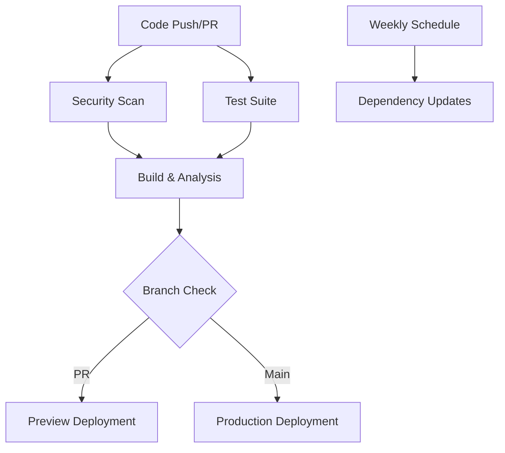

# 🚀 CI/CD Pipeline Documentation

*Updated: 2024-09-24*

## 📋 Overview

The Apophenia CI/CD pipeline implements modern DevOps best practices with comprehensive security scanning, multi-environment testing, automated deployment, and dependency management. The pipeline ensures code quality, security, and reliable deployments.

## 🏗️ Pipeline Architecture



## 🔧 Pipeline Jobs

### 1. Security Scan (`security`)
**Triggers:** All pushes, PRs, weekly schedule
**Purpose:** Vulnerability detection and security compliance

**Features:**
- **Trivy Security Scanner:** Filesystem vulnerability scanning
- **SARIF Integration:** Results uploaded to GitHub Security tab
- **NPM Audit:** Package vulnerability assessment
- **High-Severity Blocking:** Fails build on high-severity vulnerabilities

**Outputs:**
- Security scan results in GitHub Security tab
- NPM audit reports
- Vulnerability assessments

### 2. Test Suite (`test`)
**Triggers:** All pushes and PRs
**Matrix:** Node.js 18.x, 20.x, 22.x
**Purpose:** Code quality and functionality validation

**Features:**
- **Multi-Node Testing:** Ensures compatibility across Node versions
- **TypeScript Compilation:** Static type checking
- **Test Coverage:** Jest with coverage reporting
- **Configuration Validation:** Verifies required config files
- **Package Lock Integrity:** Ensures dependency consistency

**Outputs:**
- Test results and coverage reports
- TypeScript compilation status
- Codecov integration for coverage tracking

### 3. Build & Bundle Analysis (`build`)
**Triggers:** After security and test completion
**Purpose:** Production build creation and optimization analysis

**Features:**
- **Bundle Size Analysis:** Tracks build output size
- **Gzip Compression Analysis:** Optimized delivery size calculation
- **Artifact Validation:** Ensures all required build outputs exist
- **Performance Metrics:** Bundle composition and file breakdown

**Outputs:**
- Build artifacts (retained 30 days)
- Bundle size reports
- Build performance metrics

### 4. Preview Deployment (`deploy-preview`)
**Triggers:** Pull requests only
**Purpose:** Staging environment for PR review

**Features:**
- **Automated PR Comments:** Build status and metrics
- **Bundle Analysis:** Size and performance reporting
- **Artifact Distribution:** Preview builds available for download
- **Quality Gates:** Only deploys after all checks pass

**Outputs:**
- PR comments with build status
- Preview build artifacts
- Performance metrics

### 5. Production Deployment (`deploy-production`)
**Triggers:** Main branch pushes only
**Environment:** Production (requires approval if configured)
**Purpose:** Live deployment to GitHub Pages

**Features:**
- **Production Verification:** Additional safety checks
- **Source Map Detection:** Warns if source maps in production
- **Bundle Size Monitoring:** Alerts on unusual bundle sizes
- **Custom Domain Support:** Configurable via repository variables
- **Deployment Status:** GitHub Deployments API integration

**Outputs:**
- Live production deployment
- Deployment status tracking
- Production metrics

### 6. Dependency Updates (`dependency-update`)
**Triggers:** Weekly schedule (Sundays 2 AM UTC)
**Purpose:** Automated dependency monitoring

**Features:**
- **Outdated Package Detection:** Identifies available updates
- **Security Audit Reports:** Weekly security assessments
- **Automated Reporting:** Generates weekly dependency reports
- **Artifact Retention:** Dated reports for tracking

**Outputs:**
- Weekly dependency reports
- Security audit summaries
- Update recommendations

## 🔐 Security Features

### Vulnerability Scanning
- **Trivy:** Container and filesystem scanning
- **NPM Audit:** JavaScript package vulnerabilities
- **SARIF Integration:** Results in GitHub Security tab
- **Severity-Based Blocking:** Configurable failure thresholds

### Dependency Management
- **Lock File Validation:** Ensures consistent installations
- **Weekly Security Audits:** Automated vulnerability detection
- **Automated Reporting:** Tracks security status over time

### Production Safety
- **Environment Protection:** Requires approval for production deployments
- **Build Verification:** Multi-stage validation before deployment
- **Source Map Detection:** Prevents accidental debug info exposure

## 📊 Quality Gates

### Mandatory Passing Criteria
1. ✅ Security scan (no high-severity vulnerabilities)
2. ✅ All tests passing across Node versions
3. ✅ TypeScript compilation successful
4. ✅ Build artifacts generated successfully
5. ✅ Bundle size within reasonable limits

### Warning Conditions
- ⚠️ Bundle size > 2MB
- ⚠️ Source maps in production build
- ⚠️ Outdated dependencies detected
- ⚠️ Test coverage below threshold

## 🚀 Deployment Strategy

### Pull Request Flow
1. **Security Scan** → **Tests** → **Build**
2. **Preview Deployment** with automated PR comments
3. **Artifact Upload** for manual testing
4. **Merge Protection** ensures all checks pass

### Production Flow
1. **Main Branch Push** triggers production pipeline
2. **Full Security + Test + Build** cycle
3. **Production Verification** checks
4. **GitHub Pages Deployment**
5. **Deployment Status** tracking

## 📈 Monitoring & Metrics

### Build Metrics
- Bundle size tracking over time
- Build duration monitoring
- Test coverage trends
- Dependency update frequency

### Security Metrics
- Vulnerability detection rate
- Time to security fix
- Dependency risk assessment
- Security audit compliance

### Deployment Metrics
- Deployment frequency
- Success/failure rates
- Rollback frequency
- Time to deployment

## ⚙️ Configuration

### Environment Variables
```yaml
NODE_VERSION: '20.x'           # Primary Node.js version
REGISTRY: ghcr.io              # Container registry
IMAGE_NAME: ${{ github.repository }}
```

### Repository Variables
- `CUSTOM_DOMAIN`: Custom domain for GitHub Pages (optional)

### Repository Secrets
- `GITHUB_TOKEN`: Automatically provided
- Additional secrets for external integrations (if needed)

## 🔧 Customization

### Adding New Checks
1. Add job to `.github/workflows/ci.yml`
2. Configure job dependencies with `needs:`
3. Add appropriate triggers
4. Update quality gates if necessary

### Modifying Security Policies
1. Update Trivy configuration in `security` job
2. Adjust NPM audit severity levels
3. Configure SARIF upload settings
4. Update dependency policies

### Deployment Targets
1. Modify `deploy-production` job
2. Update deployment actions
3. Configure environment variables
4. Set up custom domain if needed

## 🐛 Troubleshooting

### Common Issues

**Security Job Failing**
- Check Trivy scan results in Security tab
- Review NPM audit output
- Update vulnerable dependencies

**Test Failures**
- Review test logs by Node version
- Check TypeScript compilation errors
- Verify test environment configuration

**Build Issues**
- Check bundle size analysis
- Review build artifact validation
- Verify configuration files

**Deployment Problems**
- Check GitHub Pages settings
- Verify build artifacts exist
- Review deployment logs

## 📚 Best Practices

### Code Quality
- Maintain high test coverage
- Use TypeScript strict mode
- Regular dependency updates
- Security-first approach

### Pipeline Efficiency
- Parallel job execution where possible
- Intelligent caching strategies
- Artifact reuse between jobs
- Conditional job execution

### Security
- Regular vulnerability scanning
- Dependency audit compliance
- Source map management
- Environment segregation

---

*This documentation covers the comprehensive CI/CD pipeline implementation for Apophenia. For specific configuration details, refer to `.github/workflows/ci.yml`.*