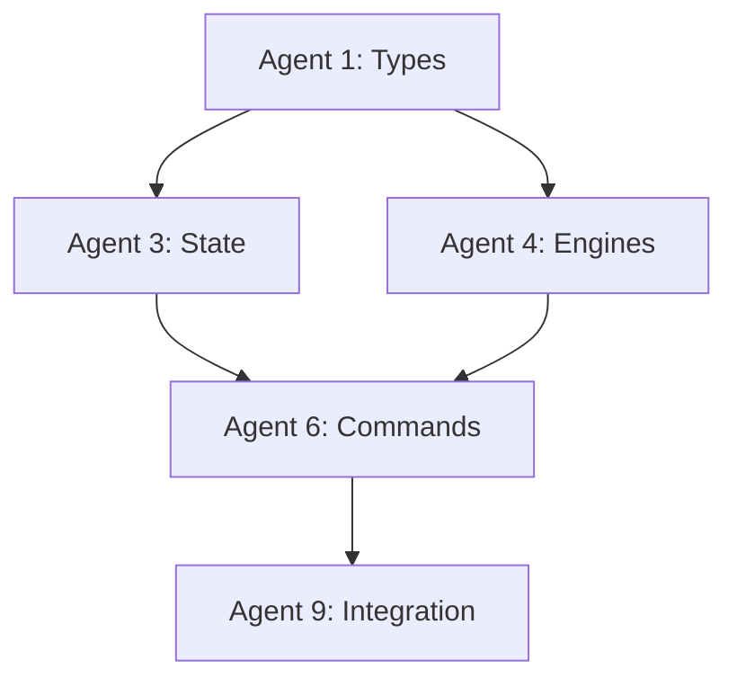
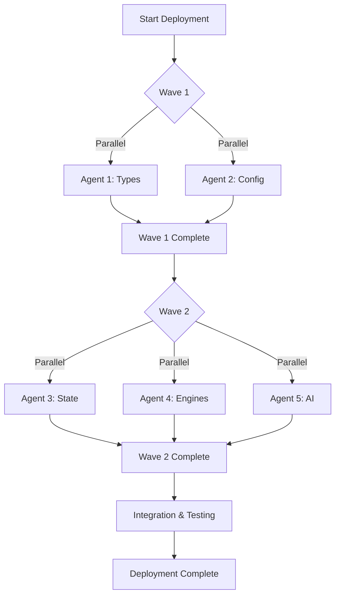
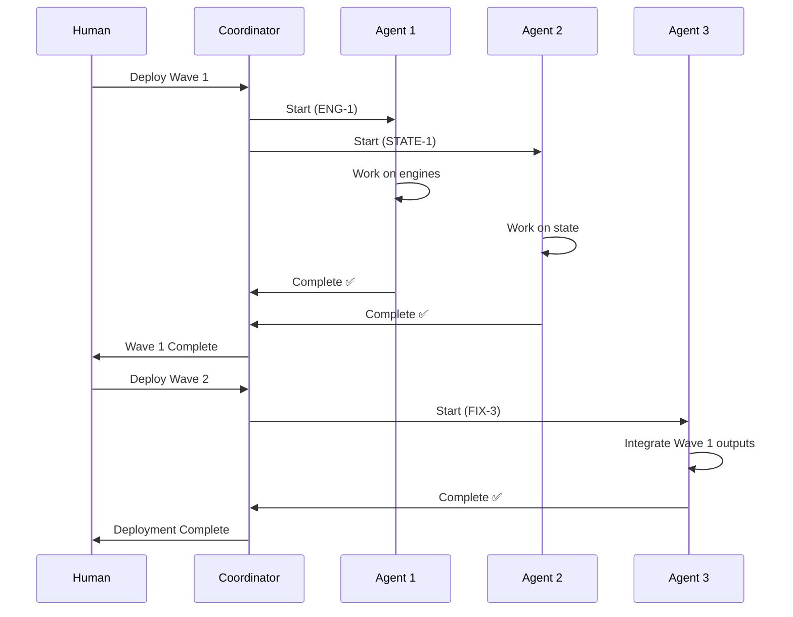

# AGENTS.md Standards for Apophenia

## Purpose

This document defines world-class standards for documenting AI agent architecture, deployment, and coordination in the Apophenia project. We extensively use parallel AI agent deployment for development workflows, requiring clear documentation of agent roles, responsibilities, dependencies, and coordination patterns.

**Why we document our agent architecture:**

- **Coordination**: Multiple agents often work in parallel; clear documentation prevents conflicts
- **Reproducibility**: Agent deployments should be repeatable with predictable outcomes
- **Learning**: Capture lessons from agent successes and failures for continuous improvement
- **Onboarding**: New contributors need to understand our multi-agent development patterns
- **Debugging**: When agents fail or conflict, documentation helps diagnose root causes
- **Accountability**: Track which agent made which changes and why

## Audience

### Primary Audiences

1. **Human Developers** - Understanding agent deployment patterns and results
2. **AI Coding Agents** - Following deployment plans and coordination protocols
3. **Project Managers** - Tracking progress across parallel agent workstreams
4. **Future Maintainers** - Understanding the evolution of the codebase through agent work

### Use Cases

- Planning multi-agent deployments for large features
- Debugging conflicts between parallel agents
- Reviewing agent performance and outcomes
- Replicating successful agent patterns
- Avoiding known anti-patterns
- Estimating agent task completion times

## Structure

### Top-Level Organization

An AGENTS.md file should follow this structure:

```markdown
# AI Agent Architecture

## Overview
[High-level description of agent usage in the project]

## In-Game AI Agents
[Documentation of runtime AI agents that are part of the application]

## Development AI Agents
[Documentation of coding agents used for development]

### Agent Deployment Principles
- When to use agents
- When NOT to use agents
- Critical rules (one agent = one PR, etc.)

### Agent Performance Metrics
- Expected completion times
- Resource usage
- Success criteria

## Multi-Agent Coordination

### Coordination Patterns
[Orchestration vs choreography, wave-based execution]

### Deployment Workflow
[Step-by-step process for deploying agents]

### Best Practices
[Proven patterns and anti-patterns]

### Common Patterns
[Reusable multi-agent deployment patterns]

### Troubleshooting
[How to handle common issues]

## Agent Registry
[Index of all agents with their responsibilities]

## Lessons Learned
[Retrospective insights from agent deployments]
```

### Separate Deployment Plans

For major multi-agent deployments, create separate deployment plan documents:

- `AGENT_DEPLOYMENT.md` - Master deployment plan for parallel agents
- `AGENT_[NAME]_REPORT.md` - Individual agent completion reports

## Agent Documentation Template

### For Development Agents in AGENTS.md

```markdown
### Agent Type: [Descriptive Name]

**When to Use:**
- [Specific use case 1]
- [Specific use case 2]

**When NOT to Use:**
- [Anti-pattern 1]
- [Anti-pattern 2]

**Expected Performance:**
- **Small tasks** (1 agent, 7-15 min): [Examples]
- **Medium tasks** (1 agent, 15-30 min): [Examples]
- **Large tasks** (1 agent, 30-60 min): [Examples]
- **Very large tasks** (3-5 agents, parallel): [Examples]

**Deployment Command:**
```typescript
// Example deployment code
```

**Monitoring:**
- Check every [X] minutes
- Expected commit frequency
- Signs of being stuck

**Success Criteria:**
- [Criterion 1]
- [Criterion 2]
```

### For Individual Agent Deployment Plans

Use this template for agents in `AGENT_DEPLOYMENT.md`:

```markdown
## 🎯 Agent [N]: [Role Name]

**Priority**: [CRITICAL | MEDIUM | LOW]
**Estimated Time**: [X-Y] minutes
**Location**: `[directory path]`
**Dependencies**: [List of agents that must complete first, or "None"]
**Wave**: [Wave number if using wave-based deployment]

### Responsibilities

[High-level description of what this agent does]

### Deliverables

1. **[Component Name]** (`path/to/file.ts`)
   - [Feature 1]
   - [Feature 2]
   - [Technical detail]

2. **[Component Name 2]** (`path/to/file2.ts`)
   - [Features...]

### Testing Requirements

- [Test category 1] with [coverage target]
- [Test category 2]
- [Coverage target]% overall

### Seam Contracts

- ✅ [Interface compliance requirement 1]
- ✅ [Architectural boundary 1]
- ✅ [Design pattern requirement 1]

### Input Requirements

**Files to Read:**
- `[path/to/reference1.ts]` - [Why]
- `[path/to/reference2.md]` - [Why]

**Configuration:**
- [Config parameter 1]: [Value]
- [Config parameter 2]: [Value]

**Context:**
- [Important context point 1]
- [Important context point 2]

### Output Specifications

**Files Created/Modified:**
- `[path/to/output1.ts]` - [Description]
- `[path/to/output2.ts]` - [Description]

**Success Metrics:**
- [ ] All interfaces implemented
- [ ] Tests passing with [X]% coverage
- [ ] Zero TypeScript errors
- [ ] No circular dependencies
- [ ] Documentation comments added

### Integration Points

**With Agent [X] ([Role]):**
- [How they integrate]
- [Shared boundaries]

**With Agent [Y] ([Role]):**
- [How they integrate]

### Error Handling

**Potential Issues:**
1. **Issue**: [Description]
   **Impact**: [Severity]
   **Mitigation**: [How to prevent/fix]

2. **Issue**: [Description]
   **Impact**: [Severity]
   **Mitigation**: [How to prevent/fix]

### Validation Checklist

Before marking complete:
- [ ] All deliverables created
- [ ] All tests passing
- [ ] No import errors
- [ ] Follows architectural seams
- [ ] Peer review complete (if applicable)
- [ ] Documentation updated
```

### For Agent Completion Reports

Use this template for `AGENT_[NAME]_REPORT.md`:

```markdown
# Agent [N]: [Role Name] - Final Report

## Executive Summary

[2-3 sentences summarizing what was accomplished]

**Status**: ✅ COMPLETE | ⚠️ PARTIAL | ❌ FAILED
**Time Invested**: [X] minutes
**Lines of Code**: ~[X] (including tests)
**Test Coverage**: [X]%
**Deliverables**: [N] files

## Mission Status

**Agent**: [Agent Name]
**Objective**: [Original objective]
**Status**: [Status with explanation]
**Integration Points**: [Summary]

## Files Created/Modified

### Core Implementation

1. **`/path/to/file1.ts`** ([N] lines)
   - [What it does]
   - [Key features]
   - [Notable implementation details]

2. **`/path/to/file2.ts`** ([N] lines)
   - [What it does]
   - [Key features]

### Tests

1. **`/path/to/test1.test.ts`** ([N] lines)
   - [What it tests]
   - [Coverage areas]

## Architecture Overview

[Diagram showing how components fit together]

```
┌─────────────────────┐
│   Component A       │
│  - Feature 1        │
└──────────┬──────────┘
           │
           ↓
┌─────────────────────┐
│   Component B       │
└─────────────────────┘
```

### Key Design Decisions

**Decision 1: [Name]**
- **Rationale**: [Why this approach]
- **Alternative Rejected**: [What was considered and why it wasn't chosen]
- **Trade-offs**: [Benefits and costs]

**Decision 2: [Name]**
- [Same structure...]

## Integration Points

### With Agent [X]
- [How they integrate]
- [Shared interfaces]
- [Data flow]

## Testing Coverage

Total coverage: **[X]%** across all [components/services]

- ✅ [Test area 1]
- ✅ [Test area 2]
- ⚠️ [Known gap 1] - [Reason]

**Run Tests:**
```bash
npm test [test-path]
```

## Challenges Encountered

1. **[Challenge Name]**
   - **Issue**: [Description]
   - **Impact**: [How it affected work]
   - **Resolution**: [How it was solved]
   - **Lesson**: [What we learned]

2. **[Challenge Name 2]**
   - [Same structure...]

## Performance Metrics

- **[Component A]**: ~[time] for [operation]
- **[Component B]**: ~[time] for [operation]

## Configuration

[Environment variables, config files, setup instructions]

## API Reference

[Key APIs and how to use them]

```typescript
// Example usage
```

## Next Steps for Integration

1. **Agent [X]**: [What they need to do]
2. **Agent [Y]**: [What they need to do]

## Validation Checklist

- ✅ All interfaces implemented
- ✅ TypeScript strict mode passes
- ✅ Unit tests written and passing
- ✅ Coverage meets target
- ✅ No circular dependencies
- ✅ Error handling implemented
- ✅ Documentation complete

## Conclusion

[Summary of what was delivered and its impact]

**Agent [N]: [Role]** ✅ COMPLETE

**Time Invested**: [X] minutes
**Lines of Code**: ~[X]
**Test Coverage**: [X]%
**Deliverables**: [N] files
```

## Coordination Patterns

### Orchestration Pattern (Centralized)

**Use when:**
- Complex dependencies between agents
- Sequential execution required
- Need central visibility and control
- One coordinator manages the workflow

**Example:**
```
Coordinator Agent
    ├─> Agent 1: Foundation (Types)
    ├─> Agent 2: Core Logic (depends on 1)
    ├─> Agent 3: Services (depends on 2)
    ├─> Agent 4: UI (depends on 3)
    └─> Agent 5: Testing (depends on all)
```

**Documentation Requirements:**
- Central deployment plan (AGENT_DEPLOYMENT.md)
- Explicit dependency graph
- Integration order specification
- Coordinator responsibilities

### Choreography Pattern (Decentralized)

**Use when:**
- Agents work independently
- No shared files/resources
- Can merge in any order
- Event-driven coordination

**Example:**
```
Agent 1: Analytics Dashboard → PR #101
Agent 2: Image Caching       → PR #102  (parallel)
Agent 3: Error Logging       → PR #103  (parallel)
Agent 4: API Documentation   → PR #104  (parallel)
```

**Documentation Requirements:**
- Clear boundaries for each agent
- Conflict detection strategy
- Merge order guidelines
- Communication protocol

### Wave-Based Execution (Hybrid)

**Use when:**
- Large feature with phases
- Some parallelism, some dependencies
- Need staged rollout

**Example:**
```
Wave 1 (Parallel):
  ├─> Agent 1: Types & Interfaces
  └─> Agent 2: Config & Constants

Wave 2 (Parallel, depends on Wave 1):
  ├─> Agent 3: State Management
  ├─> Agent 4: Core Engines
  └─> Agent 5: AI Services

Wave 3 (Parallel, depends on Wave 2):
  ├─> Agent 6: Command System
  ├─> Agent 7: Flow Orchestration
  └─> Agent 8: UI Components

Wave 4 (Sequential, depends on Wave 3):
  ├─> Agent 9: Integration (waits for 6, 7, 8)
  └─> Agent 10: Testing (waits for 9)
```

**Documentation Requirements:**
- Wave definition with dependencies
- Agent responsibilities per wave
- Wave completion criteria
- Transition checkpoints

### Pattern Selection Matrix

| Pattern | Agents | Complexity | Speed | Control | Documentation Burden |
|---------|--------|------------|-------|---------|---------------------|
| Orchestration | 1-5 | High | Medium | High | High |
| Choreography | 3-10 | Low-Medium | Fast | Low | Medium |
| Wave-Based | 5-20 | High | Fast | Medium | High |

## Best Practices

### Agent Naming Conventions

**Pattern**: `AGENT_[TYPE]-[NUMBER]_[ROLE]`

**Types:**
- `ENG` - Engine/Core Implementation
- `STATE` - State Management
- `AI` - AI Services
- `UI` - User Interface
- `CMD` - Command System
- `FLOW` - Flow Orchestration
- `TEST` - Testing
- `FIX` - Bug Fixes
- `DOC` - Documentation
- `AUDIT` - Code Audits
- `PERF` - Performance Optimization

**Examples:**
- `AGENT_ENG-1_CoreEnginesArchitect`
- `AGENT_STATE-1_StateManagementEngineer`
- `AGENT_FIX-3_CoreIntegrationEngineer`
- `AGENT_TEST-SEAM-5_SeamValidation`

### Success Criteria Definition

**SMART Criteria:**
- **Specific**: "Reduce bundle size by 20%" not "Make it faster"
- **Measurable**: "80%+ test coverage" not "Good test coverage"
- **Achievable**: "Implement 5 engines in 30 min" not "Rebuild entire app"
- **Relevant**: Aligns with project goals
- **Time-bound**: "Complete in 15-30 minutes"

**Examples:**

✅ **Good Success Criteria:**
- All 9 engine interfaces implemented exactly as specified in seams.ts
- 80%+ unit test coverage across all engines
- Zero TypeScript errors in strict mode
- No circular dependencies detected
- All engines return EngineOutput with instructions and effects

❌ **Bad Success Criteria:**
- Make the engines work
- Add some tests
- Try to avoid errors
- Make it clean

### Input/Output Specification

**Input Specification Template:**
```markdown
### Required Context
- File: `[path]` - [What information to extract]
- Documentation: `[path]` - [What to reference]
- Configuration: [Key config values]

### Constraints
- MUST use interfaces from `seams.ts`
- MUST NOT access DOM directly
- MUST return [specific type]
- MUST handle [error cases]

### Examples
[Code examples showing expected patterns]
```

**Output Specification Template:**
```markdown
### Deliverables
1. File: `[path]` ([LOC estimate])
   - Implements: [Interface]
   - Exports: [Public API]
   - Tests: [Test file path]

### Quality Gates
- [ ] TypeScript strict mode passes
- [ ] All tests pass
- [ ] Coverage ≥ [X]%
- [ ] No linting errors
- [ ] Documentation comments added

### Integration Points
- Exports: [List of exported symbols]
- Imports: [Expected import paths]
- Side effects: [Any global state changes]
```

### Dependency Documentation

**Dependency Graph Format:**
```markdown
## Agent Dependencies



**Wave 1** (No dependencies):
- Agent 1: Types & Interfaces
- Agent 2: Config & Constants

**Wave 2** (Depends on Wave 1):
- Agent 3: State Management (requires Agent 1)
- Agent 4: Core Engines (requires Agent 1)
- Agent 5: AI Services (requires Agent 1)

**Wave 3** (Depends on Wave 2):
- Agent 6: Commands (requires Agent 3, 4)
- Agent 7: Flows (requires Agent 3, 4, 5)
- Agent 8: UI (requires Agent 3)

**Wave 4** (Depends on Wave 3):
- Agent 9: Integration (requires Agent 6, 7, 8)
- Agent 10: Testing (requires Agent 9)
```

### Performance Tracking

**Metrics to Track:**
- **Planned Time**: Initial estimate
- **Actual Time**: Real completion time
- **Lines of Code**: Implementation + tests
- **Test Coverage**: Percentage
- **Commits**: Number of commits
- **Issues**: Blockers encountered
- **Rework**: Changes after integration

**Performance Log Format:**
```markdown
## Agent Performance Log

| Agent | Role | Est. Time | Actual Time | LOC | Coverage | Status |
|-------|------|-----------|-------------|-----|----------|--------|
| ENG-1 | Core Engines | 30-45 min | 40 min | 1,200 | 85% | ✅ |
| STATE-1 | State Mgmt | 20-30 min | 25 min | 800 | 90% | ✅ |
| AI-3 | AI Services | 30-40 min | 40 min | 1,900 | 80% | ✅ |
| FIX-3 | Integration | 25-35 min | 35 min | 600 | 75% | ✅ |

**Summary:**
- Total Estimated: 105-150 min
- Total Actual: 140 min
- Accuracy: 93% (within estimate range)
- Success Rate: 100% (4/4 completed)
```

## Special Considerations

### Wave-Based Deployment

**Wave Definition:**
A wave is a group of agents that can execute in parallel because they have:
1. No file conflicts (different files or non-overlapping changes)
2. No runtime dependencies (don't need each other's outputs)
3. Shared dependencies from previous waves completed

**Wave Planning Checklist:**
- [ ] Identify all dependencies between agents
- [ ] Group agents with no inter-dependencies
- [ ] Ensure wave N only depends on waves 1 to N-1
- [ ] Verify file access patterns don't conflict
- [ ] Define wave completion criteria
- [ ] Plan wave transition checkpoints

**Wave Documentation Template:**
```markdown
## Wave [N]: [Phase Name]

**Dependencies**: Wave [N-1] must be complete
**Parallelism**: [X] agents execute simultaneously
**Estimated Duration**: [X-Y] minutes (longest agent)

### Agents in This Wave

1. **Agent [ID]**: [Role] ([X-Y] min)
   - Files: [List of files]
   - No conflicts with other wave agents

2. **Agent [ID]**: [Role] ([X-Y] min)
   - Files: [List of files]
   - No conflicts with other wave agents

### Wave Completion Criteria

- [ ] All [X] agents have completed
- [ ] All PRs merged or ready to merge
- [ ] Integration tests between wave agents pass
- [ ] No blocking issues identified

### Transition to Wave [N+1]

**Trigger**: All completion criteria met
**Handoff**: [What next wave needs from this wave]
**Validation**: [How to verify wave success]
```

### Parallel Execution Safety

**Pre-Flight Checklist:**
```markdown
Before deploying parallel agents:

1. **File Conflict Analysis**
   - [ ] Run `git grep [pattern]` to find file usage
   - [ ] Check for shared utilities
   - [ ] Verify no file overlap
   - [ ] Document file ownership per agent

2. **Dependency Analysis**
   - [ ] Map all dependencies
   - [ ] Ensure no circular dependencies
   - [ ] Verify sequential tasks are not parallelized
   - [ ] Check for implicit dependencies

3. **Resource Analysis**
   - [ ] Verify sufficient PR capacity
   - [ ] Check API rate limits
   - [ ] Ensure monitoring capacity
   - [ ] Confirm merge capacity

4. **Communication Protocol**
   - [ ] Define check-in frequency
   - [ ] Set up monitoring dashboard
   - [ ] Establish escalation path
   - [ ] Create conflict resolution process
```

**Conflict Detection:**
```markdown
## Potential Conflict Matrix

|        | Agent 1 | Agent 2 | Agent 3 | Agent 4 |
|--------|---------|---------|---------|---------|
| Agent 1| -       | ✅ Safe | ✅ Safe | ❌ Conflict |
| Agent 2| ✅ Safe | -       | ✅ Safe | ✅ Safe |
| Agent 3| ✅ Safe | ✅ Safe | -       | ⚠️ Review |
| Agent 4| ❌ Conflict| ✅ Safe | ⚠️ Review| -       |

**Conflicts:**
- Agent 1 ↔ Agent 4: Both modify `gameService.ts`
  - **Resolution**: Run sequentially, Agent 1 then Agent 4

**Warnings:**
- Agent 3 ↔ Agent 4: Both use `types/seams.ts`
  - **Resolution**: Read-only, safe if no type changes
```

### Agent Failure Handling

**Failure Categories:**

1. **Stuck Agent** (no commits for 30+ min)
   ```markdown
   **Symptoms**: No commits, no PR activity
   **Diagnosis**:
   1. Check PR for error messages
   2. Review last commit (complete or mid-change?)
   3. Check for dependency blocks

   **Recovery**:
   1. Cancel agent
   2. Analyze failure cause
   3. Fix blocking issue
   4. Redeploy with updated instructions
   ```

2. **Conflicting Agents** (merge conflicts)
   ```markdown
   **Symptoms**: Merge conflicts between PRs
   **Diagnosis**:
   1. Identify overlapping files
   2. Determine which agent completed first
   3. Assess conflict severity

   **Recovery**:
   1. Merge first-completed agent
   2. Rebase second agent's branch
   3. Resolve conflicts manually
   4. Let second agent continue
   ```

3. **Failed Tests** (agent completes but tests fail)
   ```markdown
   **Symptoms**: Tests failing in PR
   **Diagnosis**:
   1. Review test output
   2. Check for integration issues
   3. Verify dependencies loaded

   **Recovery**:
   1. Create FIX agent for specific issues
   2. Update original agent's context
   3. Redeploy with fixes
   ```

4. **Incomplete Work** (agent stops mid-task)
   ```markdown
   **Symptoms**: PR exists but deliverables incomplete
   **Diagnosis**:
   1. Review completion checklist
   2. Identify missing deliverables
   3. Check for misunderstood requirements

   **Recovery**:
   1. Create continuation task
   2. Deploy new agent with remaining work
   3. Reference original PR for context
   ```

**Failure Log Template:**
```markdown
## Agent Failure Log

**Agent**: [ID and Role]
**Failure Type**: [Stuck | Conflict | Failed Tests | Incomplete]
**Time Detected**: [Time]
**Last Successful Action**: [Description]

### Diagnosis
[What went wrong and why]

### Impact
- [ ] Blocks other agents: [Yes/No, which ones]
- [ ] Breaks build: [Yes/No]
- [ ] Data loss: [Yes/No]

### Recovery Actions
1. [Action taken]
2. [Action taken]
3. [Result]

### Prevention
[How to prevent this in future deployments]

### Lessons Learned
[Key insights for future agent deployments]
```

### Rollback Procedures

**Rollback Decision Matrix:**

| Scenario | Severity | Rollback? | Alternative |
|----------|----------|-----------|-------------|
| Single agent fails | Low | No | Fix forward with new agent |
| Multiple agents conflict | Medium | Partial | Rollback conflicting agents only |
| Breaking change deployed | High | Yes | Full wave rollback |
| Tests fail in CI | Medium | Yes | Rollback all from wave |

**Rollback Procedure:**
```markdown
## Rollback Procedure for Wave [N]

### Pre-Rollback Checklist
- [ ] Identify all PRs from wave
- [ ] Verify no dependent work merged
- [ ] Create rollback branch
- [ ] Notify team of rollback

### Rollback Steps

1. **Revert Merges** (reverse order)
   ```bash
   git revert -m 1 <merge-commit-agent-N>
   git revert -m 1 <merge-commit-agent-N-1>
   # ... continue in reverse
   ```

2. **Verify Build**
   ```bash
   npm run build
   npm test
   npm run lint
   ```

3. **Create Rollback Commit**
   ```bash
   git commit -m "Rollback Wave [N]: [Reason]"
   git push origin main
   ```

4. **Document Rollback**
   - Update AGENT_DEPLOYMENT.md with rollback notice
   - Create incident report
   - Update lessons learned

### Post-Rollback
- [ ] Analyze root cause
- [ ] Fix underlying issues
- [ ] Plan redeployment strategy
- [ ] Update agent instructions
```

### Git Checkpoint Strategy

**Checkpoint Guidelines:**

1. **Wave Checkpoints**: After each wave completes
2. **Integration Checkpoints**: After merging complex integrations
3. **Milestone Checkpoints**: After major features complete

**Checkpoint Tagging:**
```bash
# Wave completion
git tag -a "wave-1-complete" -m "Wave 1: Foundation agents complete"

# Integration milestone
git tag -a "integration-point-1" -m "State + Engines integrated"

# Major milestone
git tag -a "v1.0.0-agent-rebuild" -m "Full agent rebuild complete"

# Push tags
git push origin --tags
```

**Checkpoint Documentation:**
```markdown
## Checkpoint: Wave [N] Complete

**Tag**: `wave-[N]-complete`
**Date**: [Date]
**Commit**: [SHA]

### Agents Included
- Agent [ID]: [Role] - ✅ Complete
- Agent [ID]: [Role] - ✅ Complete
- Agent [ID]: [Role] - ✅ Complete

### Deliverables
- [X] files created
- [X] tests added
- [X]% coverage achieved

### Validation
- [X] All tests passing
- [X] Build successful
- [X] No TypeScript errors
- [X] Linting clean

### Known Issues
- [Issue 1 with workaround]
- [Issue 2 deferred to next wave]

### Next Steps
- Wave [N+1] can begin
- Dependencies satisfied
- Integration points ready
```

## Visualization

### Agent Relationship Diagrams

**ASCII Architecture Diagram:**
```
┌─────────────────────────────────────────────────────────────┐
│                     Orchestration Layer                      │
│                   (FlowCoordinator)                          │
└───────────────┬─────────────────────────────────────────────┘
                │
                ├─────────────────────────────────────────┐
                │                                         │
                ↓                                         ↓
┌───────────────────────────┐           ┌───────────────────────────┐
│   Agent ENG-1             │           │   Agent STATE-1           │
│   Core Engines            │           │   State Management        │
│   ├─ Engine 1             │           │   ├─ gameStateStore       │
│   ├─ Engine 2             │           │   ├─ worldStateStore      │
│   └─ Engine Registry      │           │   └─ StateManager         │
└─────────┬─────────────────┘           └─────────┬─────────────────┘
          │                                       │
          └───────────────┬───────────────────────┘
                          │
                          ↓
          ┌───────────────────────────┐
          │   Agent FIX-3             │
          │   Integration             │
          │   ├─ App.tsx              │
          │   ├─ gameService          │
          │   └─ config               │
          └───────────────────────────┘
```

**Dependency Flow Diagram:**
```
Wave 1: Foundation
┌──────────┐     ┌──────────┐
│ Agent 1  │     │ Agent 2  │
│  Types   │     │  Config  │
└────┬─────┘     └────┬─────┘
     │                │
     └────────┬───────┘
              │
              ↓
Wave 2: Core
┌──────────┐     ┌──────────┐     ┌──────────┐
│ Agent 3  │     │ Agent 4  │     │ Agent 5  │
│  State   │     │ Engines  │     │   AI     │
└────┬─────┘     └────┬─────┘     └────┬─────┘
     │                │                │
     └────────┬───────┴────────────────┘
              │
              ↓
Wave 3: Execution
┌──────────┐     ┌──────────┐     ┌──────────┐
│ Agent 6  │     │ Agent 7  │     │ Agent 8  │
│ Commands │     │  Flows   │     │    UI    │
└────┬─────┘     └────┬─────┘     └────┬─────┘
     │                │                │
     └────────┬───────┴────────────────┘
              │
              ↓
Wave 4: Integration
┌──────────┐                 ┌──────────┐
│ Agent 9  │────────────────>│ Agent 10 │
│Integration│                │  Testing │
└──────────┘                 └──────────┘
```

**Timeline Visualization:**
```
Time →
0min    15min    30min    45min    60min
│       │        │        │        │
├─ A1 ──┤ (ENG-1: 40min)  │        │
│       ├─ A2 ──┤ (STATE-1: 25min) │
│       │       ├─ A3 ────┤ (AI-3: 40min)
│       │       │          ├─ A4 ──┤ (FIX-3: 35min)
│       │       │          │        │
Wave 1  Wave 1  Wave 2     Wave 2   Wave 3
Start   Complete Start     Complete Complete
```

**File Ownership Map:**
```
src/
├── core/
│   ├── engines/          [Agent ENG-1]
│   │   ├── base/
│   │   ├── TemporalRevisionEngine.ts
│   │   └── EngineRegistry.ts
│   ├── state/            [Agent STATE-1]
│   │   ├── gameStateStore.ts
│   │   ├── worldStateStore.ts
│   │   └── StateManager.ts
│   ├── commands/         [Agent CMD-1]
│   │   ├── base/
│   │   ├── displayText.ts
│   │   └── CommandQueue.ts
│   └── types/            [Agent TYPE-1]
│       └── seams.ts
├── services/
│   ├── ai/               [Agent AI-3]
│   │   ├── grokService.ts
│   │   └── unifiedAIService.ts
│   ├── images/           [Agent IMG-7]
│   └── gameService.ts    [Agent FIX-3]
├── flows/                [Agent FLOW-6]
├── ui/                   [Agent UI-4]
└── App.tsx               [Agent FIX-3]
```

### Mermaid Diagrams

For complex coordination, use Mermaid in documentation:

```markdown

```

```markdown

```

## Quality Checklist

### Pre-Deployment Validation

**Before deploying any agents:**

- [ ] **Clear Objectives**
  - [ ] Success criteria are SMART (Specific, Measurable, Achievable, Relevant, Time-bound)
  - [ ] Deliverables are well-defined
  - [ ] Input context is complete
  - [ ] Output specifications are clear

- [ ] **Dependency Analysis**
  - [ ] All dependencies identified and documented
  - [ ] Wave groupings make sense
  - [ ] No circular dependencies
  - [ ] File ownership is clear

- [ ] **Conflict Prevention**
  - [ ] File access patterns analyzed
  - [ ] No overlapping file modifications in parallel agents
  - [ ] Shared resources identified
  - [ ] Conflict resolution process defined

- [ ] **Resource Planning**
  - [ ] Time estimates are realistic
  - [ ] Monitoring capacity is sufficient
  - [ ] PR/merge capacity is adequate
  - [ ] Rollback plan exists

### During Deployment Monitoring

**While agents are executing:**

- [ ] **Progress Tracking**
  - [ ] Check each agent every 10-15 minutes
  - [ ] Verify commit activity
  - [ ] Monitor for stuck agents
  - [ ] Track against time estimates

- [ ] **Quality Signals**
  - [ ] Commits are meaningful and incremental
  - [ ] No error messages in PR activity
  - [ ] Tests are passing
  - [ ] Code quality looks good

- [ ] **Communication**
  - [ ] Team is aware of deployment
  - [ ] Status updates are regular
  - [ ] Issues are escalated quickly
  - [ ] Documentation is updated in real-time

### Post-Deployment Validation

**After agents complete:**

- [ ] **Deliverable Verification**
  - [ ] All planned files created/modified
  - [ ] Code compiles without errors
  - [ ] All tests passing
  - [ ] Coverage meets targets
  - [ ] Documentation is complete

- [ ] **Integration Testing**
  - [ ] Components integrate correctly
  - [ ] No type mismatches
  - [ ] No circular dependencies
  - [ ] Performance is acceptable

- [ ] **Code Quality**
  - [ ] Follows project conventions
  - [ ] No code smells
  - [ ] Proper error handling
  - [ ] Security best practices followed

- [ ] **Documentation**
  - [ ] Completion reports written
  - [ ] Lessons learned captured
  - [ ] Architecture diagrams updated
  - [ ] README/guides updated if needed

- [ ] **Cleanup**
  - [ ] Temporary files removed
  - [ ] Debug code removed
  - [ ] Comments are appropriate
  - [ ] Git history is clean

### AGENTS.md Document Quality

**The AGENTS.md file itself should meet these criteria:**

- [ ] **Completeness**
  - [ ] All agent types documented
  - [ ] All patterns explained
  - [ ] Common issues covered
  - [ ] Examples provided

- [ ] **Clarity**
  - [ ] Language is clear and concise
  - [ ] Examples are helpful
  - [ ] Diagrams illustrate concepts
  - [ ] No ambiguity in instructions

- [ ] **Accuracy**
  - [ ] Performance metrics are current
  - [ ] Examples work as shown
  - [ ] Links are valid
  - [ ] Information is up-to-date

- [ ] **Usability**
  - [ ] Easy to navigate
  - [ ] Good table of contents
  - [ ] Searchable
  - [ ] Templates are copy-pasteable

- [ ] **Maintenance**
  - [ ] Updated after each major deployment
  - [ ] Lessons learned incorporated
  - [ ] Anti-patterns documented
  - [ ] Version history maintained

## Document Maintenance

### Update Triggers

Update AGENTS.md when:

1. **New agent type introduced** - Document the pattern
2. **New coordination pattern used** - Add to patterns section
3. **Agent failure occurs** - Add to troubleshooting
4. **Performance data changes** - Update metrics
5. **Process improvement identified** - Update best practices
6. **Major deployment completes** - Add lessons learned

### Version History

Maintain a version history in AGENTS.md:

```markdown
## Document Version History

### v2.1.0 - 2025-11-12
- Added wave-based deployment patterns
- Updated performance metrics based on 10-agent deployment
- Added failure handling for integration agents
- New section: Git checkpoint strategy

### v2.0.0 - 2025-11-10
- Complete rewrite for seams-based architecture
- Added 8-agent parallel deployment pattern
- New agent types: FIX, AUDIT, INTEGRATION
- Updated time estimates based on recent data

### v1.0.0 - 2025-11-01
- Initial version
- Basic agent deployment guidelines
- Simple sequential patterns
```

### Review Schedule

- **Weekly**: Review and update performance metrics
- **After each major deployment**: Update lessons learned
- **Monthly**: Comprehensive review of all content
- **Quarterly**: Restructure if needed based on usage patterns

## Examples

### Example 1: Simple Sequential Deployment

```markdown
# Sequential Feature Development

## Agents

### Agent DOC-1: Documentation Updater
**Estimated Time**: 10-15 minutes
**Files**: `README.md`, `docs/API.md`
**Dependencies**: None

**Deliverables**:
- Update README with new features
- Add API documentation
- Update changelog

**Success**: All docs accurate and complete

---

### Agent FIX-1: Bug Fixes
**Estimated Time**: 20-30 minutes
**Files**: `src/services/buggyService.ts`
**Dependencies**: DOC-1 (should understand new API)

**Deliverables**:
- Fix issue #123
- Add regression tests
- Update error handling

**Success**: Bug fixed, tests passing
```

### Example 2: Parallel Feature Suite

```markdown
# Parallel Feature Development - Analytics Suite

## Overview
4 independent agents building analytics features

## Agents (All Parallel)

### Agent ANALYTICS-1: Dashboard
**Files**: `src/features/analytics/Dashboard.tsx`
**No conflicts with**: ANALYTICS-2, 3, 4

### Agent ANALYTICS-2: Charts
**Files**: `src/features/analytics/Charts.tsx`
**No conflicts with**: ANALYTICS-1, 3, 4

### Agent ANALYTICS-3: Export
**Files**: `src/features/analytics/Export.ts`
**No conflicts with**: ANALYTICS-1, 2, 4

### Agent ANALYTICS-4: API
**Files**: `src/services/analyticsAPI.ts`
**No conflicts with**: ANALYTICS-1, 2, 3

## Deployment

```bash
# All agents deploy at same time
# Expected completion: 15-25 minutes (longest agent)
# Merge as they complete
```
```

### Example 3: Wave-Based Architecture Rebuild

```markdown
# Wave-Based Deployment: Architecture Rebuild

## Overview
8 agents rebuilding entire architecture across 4 waves

## Wave 1: Foundation (Parallel)

### Agent TYPE-1: Type Definitions
**Time**: 15-20 min
**Files**: `src/core/types/seams.ts`

### Agent CONFIG-1: Configuration System
**Time**: 15-20 min
**Files**: `src/config/`

**Wave 1 Completion**: Both agents done, types available

---

## Wave 2: Core (Parallel, depends on Wave 1)

### Agent ENG-1: Core Engines
**Time**: 30-45 min
**Files**: `src/core/engines/`
**Uses**: Types from TYPE-1

### Agent STATE-1: State Management
**Time**: 20-30 min
**Files**: `src/core/state/`
**Uses**: Types from TYPE-1

### Agent AI-3: AI Services
**Time**: 30-40 min
**Files**: `src/services/ai/`
**Uses**: Types from TYPE-1

**Wave 2 Completion**: All 3 agents done, core systems ready

---

## Wave 3: Execution (Parallel, depends on Wave 2)

### Agent CMD-1: Command System
**Time**: 20-30 min
**Files**: `src/core/commands/`
**Uses**: STATE-1, ENG-1

### Agent FLOW-1: Flow Orchestration
**Time**: 25-35 min
**Files**: `src/flows/`
**Uses**: STATE-1, ENG-1, AI-3

### Agent UI-1: UI Components
**Time**: 25-35 min
**Files**: `src/ui/`
**Uses**: STATE-1

**Wave 3 Completion**: All execution layers ready

---

## Wave 4: Integration (Sequential, depends on Wave 3)

### Agent FIX-3: Integration
**Time**: 25-35 min
**Files**: `src/App.tsx`, `src/services/gameService.ts`
**Integrates**: All previous waves

**Wave 4 Completion**: Fully integrated system

---

## Total Timeline

- Wave 1: ~20 min (parallel)
- Wave 2: ~45 min (parallel)
- Wave 3: ~35 min (parallel)
- Wave 4: ~35 min (sequential)
- **Total: ~135 minutes (2h 15min)** vs ~215 min if sequential

## Checkpoints

- After Wave 1: Tag `wave-1-foundation`
- After Wave 2: Tag `wave-2-core`
- After Wave 3: Tag `wave-3-execution`
- After Wave 4: Tag `wave-4-complete`
```

## Conclusion

World-class agent documentation enables:

- **Efficient Coordination**: Clear roles prevent conflicts
- **Rapid Debugging**: Quick identification of issues
- **Knowledge Transfer**: Future developers understand the system
- **Continuous Improvement**: Lessons learned are captured and applied
- **Scalability**: Patterns can be replicated for new features

**Keep documentation:**
- Current (update after each deployment)
- Complete (all patterns documented)
- Clear (examples and diagrams)
- Concise (no unnecessary detail)
- Actionable (templates ready to use)

---

**Document Version**: 1.0.0
**Last Updated**: 2025-11-12
**Next Review**: 2025-12-12
**Maintained by**: Development Team
